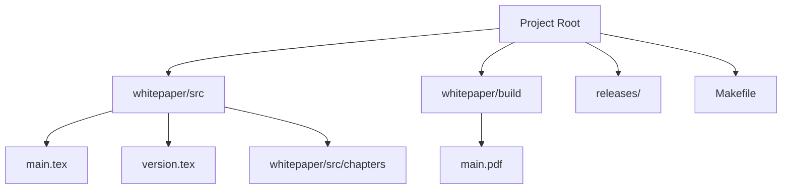

# RBK 2.0 Whitepaper Project

Ce dépôt contient les sources LaTeX et les outils de génération pour le **Livre Blanc RBK 2.0 - L'Architecture de la Souveraineté Numérique**.

## 1. Logique Métier & Objectifs
Ce document sert de référence technique, méthodologique et commerciale pour le projet RBK 2.0. Il suit une charte graphique stricte ("Solana Professional") et structure le manifeste, le syllabus technique et le business plan.

## 2. Arborescence du Projet



- **`whitepaper/src/`** : Code source LaTeX.
    - **`main.tex`** : Point d'entrée principal.
    - **`chapters/`** : Contenu découpé par chapitre/annexe.
    - **`version.tex`** : Définition manuelle de la version affichée.
- **`whitepaper/build/`** : Fichiers générés temporaires et le PDF final (`main.pdf`).
- **`releases/`** : Stockage des versions figées (snapshots).
- **`Makefile`** : Script d'automatisation des tâches.

## 3. Prérequis Techniques
Pour compiler ce projet, l'environnement doit disposer de :
- **Distribution LaTeX** : TeXLive (recommandé : `texlive-full` ou `texlive-xetex`).
- **Moteur utilisé** : `xelatex` (pour la gestion avancée des polices et du design).
- **Outils** : `make` (GNU Make).

## 4. Démarche de Compilation

### Compilation Standard
Pour générer la dernière version du document :

```bash
make build
```

> **Note** : Cette commande crée le dossier `build` si nécessaire, nettoie les artefacts temporaires et lance la compilation.

### Nettoyage
Pour supprimer les fichiers temporaires et le PDF de build :

```bash
make clean
```

## 5. Gestion des Versions & Releases

### Workflow de Mise à Jour
1. **Édition** : Modifier les fichiers `.tex` dans `whitepaper/src/chapters`.
2. **Versionning** : Mettre à jour le numéro de version dans `whitepaper/src/version.tex`.
3. **Validation** : Lancer `make build` et vérifier le PDF généré.

### Création d'une Release
Pour figer une version et l'archiver dans le dossier `releases/` :

```bash
make release VERSION=4.0.0
```

*Ceci copiera le PDF actuel vers `releases/Livre_blanc_RBK_v4.0.0.pdf`.*

## 6. Où trouver le fichier PDF ?

- **Version de travail (dernière compilation)** :  
  `whitepaper/build/main.pdf`

- **Versions archivées** :  
  `releases/`
