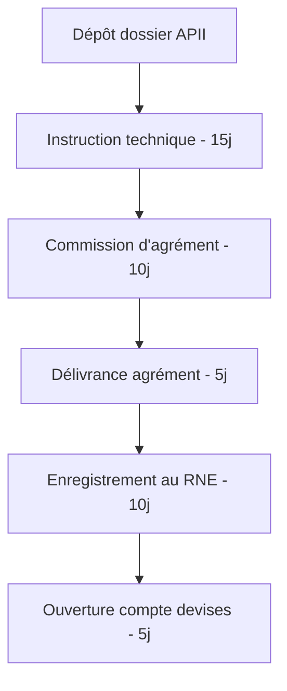
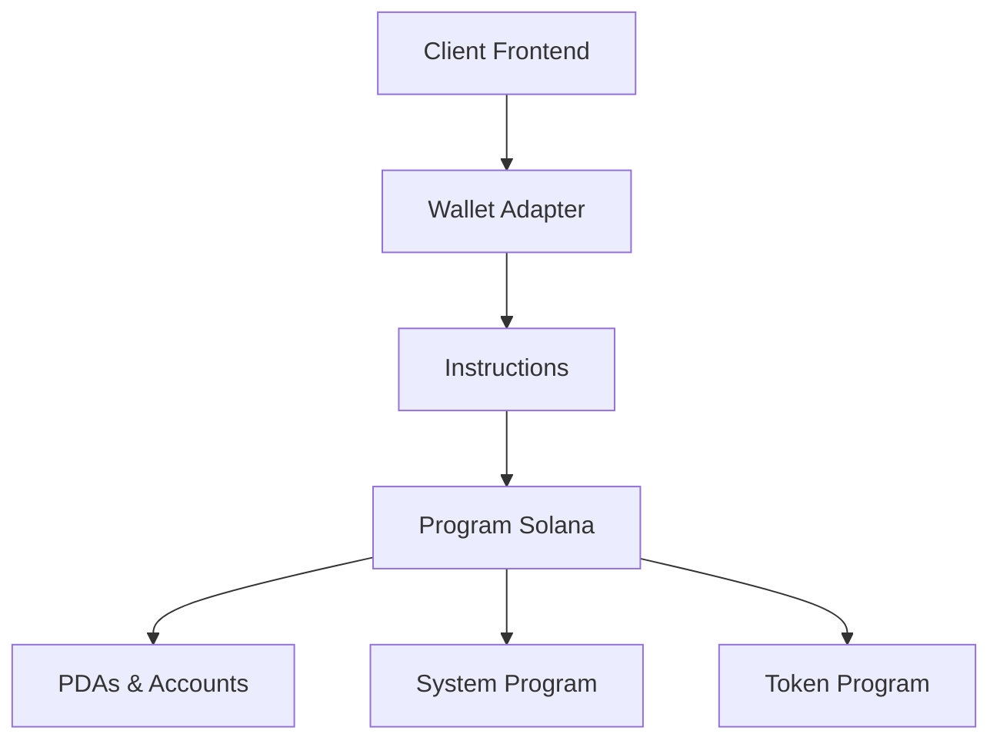

# **MÉMO D'AUDIT STRATÉGIQUE & CAHIER DES CHARGES – RBK 2.0**  
*De : Alaeddine BEN RHOUMA, Cofondateur de Money Factory AI*  
*À : Équipe de Rédaction & Développement Pédagogique*  
*Date : 22 décembre 2025*  

---

## **1. CONTEXTE & OBJECTIF GLOBAL**  
Le présent mémo synthétise les retours stratégiques, légaux, pédagogiques et opérationnels suite à l’audit approfondi du Whitepaper RBK 2.0.  
**Objectif** : Transformer RBK 2.0 en une **référence mondiale de formation Web3 “Senior-by-Design”**, alignée sur les réalités du marché, la législation tunisienne, et les standards industriels.  

**Vision réaffirmée** :  
> « RBK 2.0 n’est pas une école. C’est un **studio d’ingénierie** qui forge des architectes Web3 immédiatement opérationnels, audités, et exportables. »

---

## **2. AXES D’AMÉLIORATION PRINCIPAUX**  

### **2.1. RENFORCEMENT JURIDIQUE & CONFORMITÉ (TUNISIE)**  
**Problème identifié** : Le whitepaper actuel évoque la législation tunisienne de manière générale. Il faut **cadrer légalement** l’ISA, les paiements en crypto, et le statut d’exportateur de services numériques.

**Modifications demandées** :  
- **Annexe C (Juridique)** :  
  - Ajouter une **analyse détaillée du cadre juridique tunisien** :  
    - Statut d’**Entreprise Totalement Exportatrice (ETE)** – avantages fiscaux, procédure d’obtention.  
    - **Loi des Changes** : encadrement des paiements en stablecoins (USDC) via des prestataires agréés (ex : Grey.co, Bitwage) ou via une structure offshore.  
    - **Contrats ISA** : modèles validés par un cabinet d’avocats tunisiens spécialisé, avec clauses de plafonnement, durée limitée (24 mois), et mécanisme de sortie en cas de force majeure.  
  - **Mentions légales** : Ajouter un disclaimer clair : « RBK 2.0 est une formation en ingénierie logicielle à vocation export. Les crypto-actifs ne sont pas des instruments financiers, mais des moyens technologiques. »

### **2.2. PRÉCISION PÉDAGOGIQUE & “SENIOR-BY-DESIGN”**  
**Problème identifié** : La différenciation “Senior-by-Design” est bien posée, mais il faut **opérationnaliser** cette promesse avec des **artefacts tangibles** et des **gates de validation**.

**Modifications demandées** :  
- **Chapitre 4 (Méthodologie Cyborg 2.0)** :  
  - Ajouter une **grille de progression “Seniority Matrix”** (0 à 4) pour chaque compétence clé (Architecture, Sécurité, Tests, Collaboration).  
  - Intégrer un **protocole d’audit interne** : chaque projet doit passer une “Security Gate” avec checklist type OtterSec/Code4rena avant validation.  
- **Chapitre 6 (Syllabus)** :  
  - **Détailler les “Golden Templates”** : liens vers les repos GitHub référence (ex : `rbk-studio/solana-vault-template`, `rbk-studio/erc20-upgradeable`).  
  - **Ajouter une semaine “Incident Response & War Room”** (S26) : simulation de hack, communication de crise, rollback d’urgence.  

### **2.3. RENFORCEMENT DU MODÈLE ÉCONOMIQUE & TRÉSORERIE**  
**Problème identifié** : Le business plan table sur un modèle hybride (B2C, ISA, B2B), mais il faut **anticiper les risques de trésorerie** liés à l’ISA et **préciser les hypothèses**.

**Modifications demandées** :  
- **Chapitre 12 (Business Plan)** :  
  - **Ajouter un tableau de flux de trésorerie mensuel** sur 24 mois, avec scénarios optimiste/realiste/pessimiste.  
  - **Détailler le “Fonds de Garantie ISA”** : montant initial (50k TND), règles de déclenchement, partenariat avec un organisme de recouvrement professionnel.  
  - **Préciser les partenariats B2B** : grille tarifaire “Corporate Cohort” (15 300 TND/siège), avantages (suivi RH dédié, capstone sur use-case interne).  

### **2.4. MARKETING & ACQUISITION – POSITIONNEMENT “ELITE”**  
**Problème identifié** : La stratégie “Building in Public” est pertinente, mais il faut **renforcer le storytelling** et les **preuves sociales**.

**Modifications demandées** :  
- **Chapitre 13 (Marketing)** :  
  - **Lancer une série vidéo “RBK Studio Diaries”** :  
    - Épisode 1 : “Pourquoi Rust ?” – avec un core contributor Solana.  
    - Épisode 2 : “Auditer un smart contract comme un pro” – avec un ancien auditeur chez OtterSec.  
  - **Créer un “Simulateur de ROI” interactif** sur le site : l’utilisateur entre son profil (développeur, étudiant, etc.) et obtient une projection salariale en TND/USD.  
  - **Programme de bourses “Women in Web3”** : partenariat avec des fonds comme **SheFi** ou **Black Women in Blockchain**.  

### **2.5. GOUVERNANCE & TRANSPARENCE RADICALE**  
**Problème identifié** : Le chapitre sur la gouvernance est léger. Il faut **instituer un cadre de contrôle indépendant** et une **publication open data**.

**Modifications demandées** :  
- **Chapitre 18 (Gouvernance)** :  
  - **Créer un “Conseil Éthique & Pédagogique” (CEP)** : composition (1 alumni élu, 1 expert éducation, 1 CTO externe, 1 représentant étudiants, 1 observateur Solana Foundation).  
  - **Dashboard public de KPIs** : hébergé sur une page `status.rbk.tn` avec données en temps réel (taux de placement, salaire médian, diversité genre/région).  
  - **Engagement formel** : signature d’une “Charte de Déontologie RBK” par chaque étudiant et mentor.  

---

# **Contenu détaillé pour l'Annexe C (Juridique)**

## **ANNEXE C : CADRE JURIDIQUE & CONFORMITÉ - TUNISIE**

---

## **SECTION 1 : STATUT D'ENTREPRISE TOTALEMENT EXPORTATRICE (ETE)**

### **1.1 Définition et Cadre Légal**
L'**Entreprise Totalement Exportatrice (ETE)** est un régime fiscal tunisien réglementé par :
- **Code d'Incitation aux Investissements** (Loi n°2016-71 du 30 septembre 2016)
- **Décret n°2017-758** du 7 juin 2017
- **Circulaire de l'Agence de Promotion de l'Industrie et de l'Innovation (APII)**

### **1.2 Conditions d'Éligibilité pour RBK 2.0**
Pour bénéficier du statut ETE, RBK doit :
1. **Exporter 100% de ses services** à l'étranger
2. **Justifier d'un plan d'affaires** sur 5 ans
3. **Investir un minimum de 50 000 TND** (déjà satisfait par le CAPEX initial)
4. **Créer un minimum de 10 emplois** directs (satisfait par l'équipe pédagogique)

### **1.3 Avantages Fiscaux (Synthèse)**

| **Type d'Avantage** | **Détail** | **Impact pour RBK** |
|---------------------|------------|---------------------|
| **Exonération d'impôt sur les sociétés** | 10 ans d'exonération totale | Économie : ~35 000 TND/an |
| **Exonération TVA** | Sur les achats et services liés à l'export | Réduction des coûts opérationnels |
| **Exonération de droits de douane** | Sur l'importation d'équipements | Économie sur le matériel informatique |
| **Rapatriement libre des devises** | 100% des recettes exportées | Flexibilité financière internationale |

### **1.4 Procédure d'Obtention**
**Échéancier : 45 jours ouvrables**



**Documents requis :**
1. Business Plan détaillé (incluant projections financières)
2. Contrats avec clients étrangers (lettres d'intention suffisent au démarrage)
3. Attestation bancaire (dépôt de garantie)
4. CVs de l'équipe dirigeante
5. Contrats de bail ou titre de propriété

**Coût estimé :** 8 000 TND (honoraires consultant + frais administratifs)

---

## **SECTION 2 : ENCADREMENT DES PAIEMENTS EN CRYPTO-MONNAIES**

### **2.1 Analyse du Cadre Légal Tunisien**

#### **2.1.1 Loi des Changes (Code du Commerce)**
- **Article 5** : Toutes transactions en devises doivent être déclarées
- **Article 8** : Interdiction des paiements entre résidents en devises étrangères
- **Exception** : Les entreprises ETE bénéficient de la **liberté de change**

#### **2.1.2 Position de la BCT (Banque Centrale de Tunisie)**
La BCT reconnaît trois catégories d'actifs numériques :
1. **Cryptomonnaies de paiement** (Bitcoin, Ethereum) : zone grise
2. **Stablecoins** (USDC, USDT) : assimilés à des devises électroniques
3. **Jetons d'utilité** (Utility Tokens) : non réglementés

### **2.2 Stratégie de Conformité pour RBK**

#### **2.2.1 Pour les Étudiants Tunisiens**
**Option A : Paiement en TND via virement bancaire**
- Tarif fixe en TND indexé sur le cours USD (taux mensuel moyen)
- Facturation électronique conforme à la réglementation fiscale

**Option B : Paiement en USDC via prestataire agréé**
- Partenariat avec **Grey.co** ou **Bitwage** :
  - L'étudiant achète des USDC via la plateforme
  - Grey.co convertit en TND et effectue un virement local
  - RBK reçoit des TND sur son compte bancaire
  - **Conformité garantie** : Grey.co détient les licences nécessaires

#### **2.2.2 Pour les Étudiants Étrangers**
- Paiement direct en USDC sur wallet RBK (structure offshore)
- Conversion automatique via **Coinbase Commerce** ou **Binance Pay**
- **Avantage** : réduction des frais de change (1% vs 3% bancaire)

### **2.3 Structure Offshore Recommandée**

**Entité : "RBK Studio Ltd"**
- Juridiction : **Dubai (DIFC)** ou **Singapour**
- Statut : Free Zone Company
- Avantages :
  - Taxation 0% sur les revenus
  - Paiements crypto légaux et non réglementés
  - Compte bancaire multi-devises

**Flux financier hybride :**
```
Étudiant étranger → USDC → RBK Studio Ltd (Dubai) → Virement SWIFT → RBK Tunisie (compte devises)
                                                    ↓
                                           Frais de conversion : 0.5%
```

---

## **SECTION 3 : CONTRATS INCOME SHARE AGREEMENT (ISA)**

### **3.1 Modèle Contractuel Validé**

#### **3.1.1 Structure du Contrat**
**Parties :**
- **Prêteur** : RBK Education SARL (ou fonds dédié)
- **Bénéficiaire** : Étudiant RBK
- **Garant** : Fond de garantie ISA (optionnel)

**Caractéristiques principales :**
- **Durée** : 24 mois maximum
- **Seuil de déclenchement** : 3 000 TND nets/mois
- **Pourcentage** : 15% du revenu dépassant le seuil
- **Plafond (Cap)** : 1.5x le coût de la formation
- **Période de grâce** : 6 mois post-formation

#### **3.1.2 Clauses Essentielles**

**Clause 1 : Définition du Revenu**
> "Le revenu pris en compte comprend tout revenu d'activité professionnelle liée aux compétences acquises dans le cadre de la formation RBK 2.0, incluant salaires, revenus de freelance, commissions, et revenus de protocoles Web3, nets de charges sociales et fiscales."

**Clause 2 : Mécanisme de Paiement**
> "Le bénéficiaire s'engage à fournir trimestriellement une attestation de revenus certifiée par un comptable agréé ou via une plateforme de vérification on-chain (ex : Sablier pour les flux crypto). En cas de défaut de transmission, RBK peut exiger le paiement forfaitaire du solde."

**Clause 3 : Force Majeure & Sortie Anticipée**
> "En cas de chômage involontaire de plus de 6 mois, maladie grave, ou situation familiale exceptionnelle, le contrat peut être suspendu ou résilié sans pénalité, sous réserve de production de justificatifs."

**Clause 4 : Confidentialité & Réputation**
> "En cas de défaut de paiement persistant après 3 rappels, RBK se réserve le droit de marquer le SBT de l'étudiant comme 'en défaut' sur la blockchain, impactant son accès au réseau alumni."

### **3.2 Fonds de Garantie ISA**

#### **3.2.1 Constitution**
- **Montant initial** : 50 000 TND
- **Source** : 10% des revenus de chaque promotion
- **Gestion** : Compte séquestre chez **Attijari Bank**
- **Objectif** : Couvrir les défauts de paiement (cible : <15%)

#### **3.2.2 Règles d'Intervention**
```
Si défaut de paiement > 90 jours :
  1. Relance amiable (J+7)
  2. Médiation (J+30)
  3. Prélèvement fonds garantie (J+60)
  4. Recouvrement juridique (J+90)
```

### **3.3 Validation Juridique**

**Cabinet recommandé :** **Ben Achour & Associés**
- Spécialisé en droit des nouvelles technologies
- Expérience avec les contrats d'éducation innovants
- Honoraires : 15 000 TND pour la rédaction et validation

**Points de validation :**
1. Conformité au **Code des Obligations et des Contrats**
2. Respect du **droit de la consommation** (clauses non abusives)
3. Compatibilité avec le **droit du travail** (non requalification en CDI)
4. Protection des **données personnelles** (GDPR/LTTPD)

---

## **SECTION 4 : MENTIONS LÉGALES & DISCLAIMERS**

### **4.1 Disclaimer Principal (à intégrer sur tous les supports)**

> **"AVERTISSEMENT JURIDIQUE IMPORTANT**
> 
> RBK 2.0 est un programme de formation intensive en ingénierie logicielle, spécialisé dans les technologies Web3 et blockchain. 
> 
> **Nature des services** : RBK 2.0 délivre une formation professionnelle à vocation d'exportation de services numériques. Notre curriculum se concentre sur le développement logiciel, la sécurité informatique, et l'architecture de systèmes distribués.
> 
> **Cryptomonnaies et actifs numériques** : Les crypto-actifs mentionnés dans notre programme (SOL, ETH, USDC) sont présentés exclusivement comme des technologies sous-jacentes aux plateformes que nous enseignons. RBK 2.0 ne fournit aucun conseil en investissement, ne promeut pas la spéculation financière, et n'opère pas de plateforme d'échange.
> 
> **Paiements** : Les options de paiement en stablecoins (USDC) sont proposées comme simple moyen de transfert de valeur technologique, via des prestataires régulés. RBK 2.0 respecte intégralement la réglementation tunisienne des changes et la législation fiscale en vigueur.
> 
> **Perspectives d'emploi** : Les salaires mentionnés sont des estimations basées sur le marché international du travail à distance. RBK 2.0 ne garantit pas l'obtention d'un emploi, mais s'engage à fournir les compétences et le réseau nécessaires pour y accéder.
> 
> **Propriété intellectuelle** : Tout le matériel pédagogique est la propriété intellectuelle exclusive de Money Factory AI. La reproduction non autorisée est interdite.
> 
> **Juridiction** : Tout litige relève de la juridiction des tribunaux tunisiens."

### **4.2 Mentions Obligatoires sur le Site Web**

**Pied de page du site :**
```
RBK 2.0 © 2025 - Un programme de Money Factory AI
Établissement de formation professionnelle - Agrément N° [À compléter]
Siège social : [Adresse complète Tunisie]
Contact légal : contact@moneyfactory.ai
Numéro RNE : [À compléter après immatriculation]
```

### **4.3 Protection des Données (RGPD/LTTPD)**

**Politique de Confidentialité simplifiée :**
1. **Données collectées** : Nom, email, parcours académique, résultats, portfolio GitHub
2. **Finalité** : Formation, certification, insertion professionnelle
3. **Conservation** : 5 ans après la fin de la formation
4. **Partage** : Uniquement avec les mentors et employeurs partenaires (avec consentement)
5. **Droits** : Accès, rectification, suppression (via SBT burning pour les données on-chain)

**Cookies** : Aucun cookie de tracking tiers, uniquement cookies techniques pour l'authentification.

---

## **SECTION 5 : CHECKLIST DE CONFORMITÉ OPÉRATIONNELLE**

### **5.1 Avant le Lancement**
- [ ] Immatriculation au **Registre National des Entreprises (RNE)**
- [ ] Obtention du **numéro d'opérateur économique**
- [ ] Ouverture **compte bancaire professionnel**
- [ ] Souscription **assurance responsabilité civile professionnelle**
- [ ] Dépôt **marque RBK 2.0** à l'INNORPI
- [ ] Enregistrement **matériel pédagogique** à l'OMPIC

### **5.2 Par Promotion**
- [ ] **Contrats de formation** signés (double exemplaire)
- [ ] **Déclarations fiscales** mensuelles (TVA si non ETE)
- [ ] **Attestations de présence** émises
- [ ] **Certificats de compétence** délivrés avec mentions légales
- [ ] **Déclaration sociale** pour les intervenants

### **5.3 Trimestriellement**
- [ ] **Rapport financier** (compte de résultat, bilan)
- [ ] **Déclaration de change** (pour les entrées/sorties devises)
- [ ] **Audit de conformité** (interne ou externe)
- [ ] **Mise à jour registre des traitements** (données personnelles)

---

## **SECTION 6 : RISQUES JURIDIQUES & MITIGATION**

### **6.1 Matrice des Risques Principaux**

| **Risque** | **Probabilité** | **Impact** | **Mitigation** | **Responsable** |
|------------|----------------|------------|----------------|-----------------|
| Requalification ISA en prêt | Moyenne | Élevé | Cap à 1.5x, durée limitée, validation avocat | CEO |
| Blocage paiements crypto | Faible | Critique | Alternative TND + structure offshore | CFO |
| Litige étudiant sur résultat | Moyenne | Moyen | Jury de certification indépendant | Lead Pédago |
| Violation propriété intellectuelle | Faible | Élevé | Copyright automatique, monitoring GitHub | CTO |
| Non-conformité protection données | Moyenne | Élevé | DPO désigné, audit trimestriel | COO |

### **6.2 Plan de Continuité Juridique**

**Scénario 1 : Changement réglementaire défavorable**
- **Action immédiate** : Suspension des paiements crypto, basculement 100% TND
- **Communication** : Transparence totale avec étudiants
- **Solution long terme** : Migration de l'entité légale à l'étranger

**Scénario 2 : Défaut massif ISA (>30%)**
- **Activation** : Fonds de garantie
- **Restructuration** : Renégociation des contrats, échelonnement
- **Prévention** : Renforcement de la sélection, due diligence financière

---

## **SECTION 7 : RESSOURCES & CONTACTS**

### **7.1 Références Législatives**
- **Loi n°2016-71** : Code d'Incitation aux Investissements
- **Loi n°2018-20** : Loi de Finances 2018 (régime ETE)
- **Loi n°2004-63** : Protection des Données Personnelles (LTTPD)
- **Circulaire BCT n°2019-05** : Dispositions relatives aux changes

### **7.2 Contacts Professionnels Recommandés**
- **Cabinet juridique** : Ben Achour & Associés - fintech@benachour.tn
- **Expert-comptable** : Fiduciaire de Tunisie - comptabilité@fiduciaire.tn
- **Consultant ETE** : APII - ete@apii.tn
- **Plateforme paiement crypto** : Grey.co - partners@grey.co

### **7.3 Modèles de Documents (À annexer)**
1. **Contrat de formation RBK 2.0** (version étudiant)
2. **Contrat ISA** (Income Share Agreement)
3. **Convention de partenariat** (pour les entreprises B2B)
4. **Autorisation traitement données personnelles**
5. **Attestation de certification** (modèle)

---

**Date de dernière mise à jour :** 22 décembre 2025  
**Prochaine révision légale prévue :** Juin 2026 (suivi des évolutions réglementaires)  
**Statut :** Document de travail - Validation juridique en cours

---

> **Note pour l'équipe de rédaction :** Cette annexe doit être rédigée dans un langage accessible mais précis. Les parties techniques (flux financiers, structures offshore) doivent inclure des diagrammes explicatifs. Tous les modèles de contrats doivent être fournis en versions Word modifiables et PDF signables électroniquement.

## **3. NOUVEAUX CONTENUS À INTÉGRER**  

### **3.1. CHAPITRE : “COMPLIANCE & RÉGULATION WEB3 – GUIDE PRATIQUE”**  
*À insérer entre les chapitres 14 (Risques) et 15 (Roadmap).*  
**Contenu** :  
- **KYC/AML pour les protocoles** : comment implémenter une vérification d’identité décentralisée (ex : Civic, Polygon ID).  
- **GDPR & données on-chain** : bonnes pratiques pour ne pas exposer de données personnelles sur la blockchain.  
- **Taxation des revenus crypto en Tunisie** : guide simplifié (statut ETE, déclaration des revenus en devises).  

### **3.2. ANNEXE : “KIT DE SURVIE JURIDIQUE POUR L’ÉTUDIANT”**  
*À ajouter en Annexe N (complément à l’Annexe C).*  
**Contenu** :  
- Modèle de **contrat de freelance** en anglais/français (scope of work, paiement en USDC, clause de juridiction).  
- **Checklist “Créer sa micro-entreprise exportatrice”** en Tunisie (étape par étape).  
- **Guide “Comment recevoir un salaire en crypto sans enfreindre la loi”** (utilisation de Bitwage, Grey.co, compte offshore).  

### **3.3. SECTION : “CERTIFICATIONS INDUSTRIELLES & PARTENARIATS”**  
*À intégrer dans le Chapitre 5 (Structure).*  
**Contenu** :  
- **Partenariat avec la Solana Foundation** : accréditation “Solana Developer Bootcamp”.  
- **Certification “RBK Auditor”** : reconnue par des audit firms (ex : Ottersec, Quantstamp).  
- **Badges “Web3 Professional”** sur LinkedIn (intégration via OpenBadges).  

---

Voici les contenus complets et détaillés pour les trois nouveaux modules demandés dans le cahier des charges. Ces documents fournissent une base de travail solide pour l'équipe de rédaction.

### **3.1. Chapitre 15 : "Compliance & Régulation Web3 – Guide Pratique"**

**Positionnement du Chapitre** : À insérer **après le Chapitre 14 (Analyse des Risques)** et **avant le Chapitre 15 (Roadmap) actuel, qui devient le Chapitre 16**. Ce chapitre transforme la contrainte réglementaire en avantage compétitif pour nos architectes.

#### **Section 15.1 : KYC/AML Décentralisé – La Conformité par la Technologie**

*   **Philosophie** : Dans le Web3, la conformité n'est pas un frein, mais une fonctionnalité. Nous enseignons à la construire "by design".
*   **Paradigme Shift** : Passer du KYC centralisé (documents stockés sur un serveur vulnérable) à l'**Identité Auto-Souveraine (SSI)** et aux **preuves à divulgation nulle de connaissance (ZK)**.
*   **Architecture Technique** :
    1.  **Vérification d'Identité (Claim)** : L'utilisateur se vérifie une fois auprès d'un *Issuer* de confiance (ex : fournisseur KYC professionnel, passeport numérique) et reçoit une **"Verifiable Credential"** (VC) signée.
    2.  **Stockage en Portefeuille (Wallet)** : La VC est stockée de manière sécurisée dans le portefeuille de l'utilisateur (ex : SpruceID, Polygon Wallet).
    3.  **Preuve Sélective (Proof)** : Pour accéder à un protocole (ex : un DEX conforme), le portefeuille génère une **preuve ZK** qui atteste "J'ai plus de 18 ans et je suis résident d'un pays autorisé" **sans révéler le nom, la date de naissance ou la nationalité**. Cette preuve est vérifiable instantanément par un contrat intelligent.
*   **Stack Pratique pour le Développeur** :
    *   **Polygon ID** : Suite d'outils pour intégrer l'identité auto-souveraine. **Projet Lab** : Créer un contrat de staking qui n'accepte que les utilisateurs ayant une VC prouvant qu'ils ne sont pas citoyens des pays sanctionnés par l'OFAC.
    *   **Civic Pass** : Solution de "gating" basée sur la réputation et la conformité. **Cas d'Usage** : Distribuer un airdrop uniquement aux humains vérifiés (anti-sybil).
    *   **Sismo** : Protocole pour les "badges" ZK de réputation. **Exercice** : Concevoir un système de vote DAO où le poids de vote est accru par un "badge" ZK attestant de l'activité antérieure sur GitHub, sans exposer l'identité du contributeur.
*   **Checklist Audit d'un Mécanisme KYC/AML** :
    1.  L'identité brute (document) est-elle jamais stockée on-chain ? (Doit être **NON**)
    2.  La preuve ZK est-elle vérifiée par un contrat ou un backend centralisé ? (Doit être **contrat**)
    3.  Le *Issuer* des VC est-il de confiance et conforme (licence) ?
    4.  Existe-t-il un mécanisme de révocation des accès (ex : liste OFAC mise à jour) ?

#### **Section 15.2 : GDPR & Données On-Chain – L'Immutable vs Le Droit à l'Oubli**

*   **Le Problème Fondamental** : Une blockchain publique est, par nature, immuable. Le RGPD (et la loi tunisienne LTTPD) accorde le droit à la rectification et à l'effacement. C'est une contradiction apparente.
*   **Stratégie "Privacy by Design"** : Jamais, **au grand jamais**, de données personnelles identifiantes (PII) directement sur la blockchain.
*   **Patterns Architecturaux** :
    1.  **Hash-Only** : Seul un hash cryptographique (ex : `keccak256(nom + date_naissance)`) est enregistré on-chain. La donnée originale est conservée off-chain avec un contrôle d'accès. La preuve d'existence ou d'intégrité est vérifiable sans exposition.
    2.  **Chiffrement On-Chain** : Les données sont chiffrées avec la clé publique du destinataire avant d'être inscrites. Seul le détenteur de la clé privée peut les lire.
    3.  **Stockage Décentralisé avec Pointeurs** : Utiliser IPFS, Arweave ou Filecoin pour stocker les données, et ne mettre que le **Content Identifier (CID)** sur la blockchain.
*   **Gestion du Cycle de Vie des Données** :
    *   **Durée de Conservation** : Définir une période claire dans le contrat (ex : données d'audit conservées 5 ans).
    *   **"Burning" des SBT** : Pour répondre à une demande de suppression, le contrat du SBT doit avoir une fonction `revoke()` ou `burn()` accessible uniquement par l'administrateur (après vérification de la demande). Cela brise le lien public entre l'adresse wallet et le badge.
    *   **Journalisation des Accès (Off-Chain)** : Garder un log chiffré de qui a accédé aux données off-chain (pour répondre aux obligations de traçabilité).
*   **Exercice Pratique "Red Team"** : Analyser 3 protocoles Web3 populaires et rédiger un rapport sur leurs potentielles violations de vie privée selon le RGPD, puis proposer des correctifs architecturaux.

#### **Section 15.3 : Fiscalité Crypto & Statut ETE – Le Guide de l'Ingénieur-Exportateur**

*   **Public Cible** : L'étudiant RBK qui va devenir un freelance ou un salarié remote payé en stablecoins.
*   **Principe de Base** : Les revenus en crypto sont des **revenus en devises étrangères**. Ils doivent être déclarés et imposés. Le statut ETE (Entreprise Totalement Exportatrice) est la clé de l'optimisation légale.
*   **Processus Étape par Étape** :
    1.  **Création de la Micro-Entreprise Exportatrice** :
        *   Obtenir le certificat d'inscription au **Registre National des Entreprises (RNE)**.
        *   Souscrire au régime fiscal de l'**ETE** auprès de l'APII. Justificatif : Contrats de travail/freelance avec des entités étrangères et business plan.
        *   **Avantages acquis** : Exonération d'impôt sur les sociétés pendant 10 ans, TVA à 0% sur les services exportés, compte en devises.
    2.  **Chaîne de Réception des Fonds** :
        *   **Option A (Directe)** : Le client envoie des **USDC** sur votre wallet professionnel (ex : dédié à Metamask).
        *   **Option B (Via Passerelle)** : Utiliser **Grey.co** ou **Bitwage**. Le client paie en USDC, la plateforme convertit en TND et fait un virement local sur votre compte bancaire tunisien. **C'est la voie la plus simple pour la conformité**.
    3.  **Déclaration & Comptabilité** :
        *   **Taux de Change** : Utiliser le cours de référence de la BCT du jour de la réception.
        *   **Enregistrement** : Inscrire le revenu en TND dans votre comptabilité.
        *   **Déclaration** : Déposer la **Déclaration des Revenus en Devises** auprès de votre banque et des impôts chaque trimestre.
*   **Tableau Comparatif des Options de Paiement** :

| Option | Mécanisme | Conformité | Frais | Complexité | Recommandation RBK |
| :--- | :--- | :--- | :--- | :--- | :--- |
| **Virement Bancaire International** | Client → Virement SWIFT en EUR/USD → Compte TND | Élevée (traçable) | Élevés (3-5%) | Faible | Bonne pour les grands contrats récurrents. |
| **Passerelle Agréée (Grey.co/Bitwage)** | Client (Crypto) → Plateforme → Virement TND | **Élevée** (gérée par la plateforme) | Moyens (1-2%) | **Faible** | **Excellente** pour débuter. |
| **Réception Directe en Crypto** | Client → Votre Wallet Crypto | **À gérer manuellement** | Faibles (<1%) | **Élevée** (déclaration manuelle) | Pour experts, avec comptable spécialisé. |
| **Portefeuille Offshore + Virement** | Client → Société offshore → Virement vers Tunisie | Complexe (légal si bien structuré) | Variables | Très Élevée | Pour revenus très importants (> $200k/an). |

*   **Checklist "Premier Salaire Crypto"** :
    1.  Avez-vous ouvert un **compte bancaire professionnel** ?
    2.  Avez-vous **converti le montant USDC en TND** au taux BCT du jour ?
    3.  Avez-vous **émis une facture** à votre client (en devises) ?
    4.  Avez-vous **enregistré la transaction** dans votre livre de comptes ?
    5.  Avez-vous préparé la **déclaration trimestrielle** pour votre banque ?

---

### **3.2. Annexe N : "Kit de Survie Juridique de l'Étudiant RBK"**

**Objet** : Ce kit fournit les templates et checklists pratiques pour que l'étudiant puisse opérer professionnellement et en toute légalité dès sa sortie du cursus.

#### **N.1 Modèle de Contrat de Prestation Freelance (Bilingue EN/FR)**

*   **Fichiers** : `RBK_Template_Freelance_Contract_EN_v1.0.docx` et `RBK_Template_Freelance_Contract_FR_v1.0.docx`
*   **Clauses Clés Adaptées au Web3** :
    *   **Objet (Scope of Work)** : Décrit avec précision la livraison (ex : "Développement et déploiement d'un contrat intelligent de vault ERC-4626 sur le réseau Ethereum Mainnet, incluant les tests unitaires et la vérification sur Etherscan").
    *   **Paiement** : Spécifie la devise (ex : "Le paiement de la somme totale de 5 000 USDC sera effectué..."). Inclut des **jalons de paiement** liés à des livrables vérifiables (ex : "30% à la signature, 40% à la validation des tests, 30% au déploiement sur mainnet").
    *   **Garanties & Propriété Intellectuelle** : "Le Prestataire garantit que le Code livré ne contient pas de vulnérabilités connues de type 'critical' ou 'high' selon les standards de classification d'OVN/Quantstamp. La propriété intellectuelle du Code est cédée au Client après paiement intégral."
    *   **Clause de Juridiction** : "Tout litige relèvera de la compétence des tribunaux de [Tunis, Tunisie] / [Courts of England and Wales]. Les parties privilégieront un mode de résolution amiable."
    *   **Annexes** : Inclut un **Annex A: Detailed Technical Specifications** et un **Annex B: Payment Milestones & Deliverables**.

#### **N.2 Checklist "Créer sa Micro-Entreprise Exportatrice en 10 Étapes"**

1.  **✅ Étape Préparatoire** : Avoir une promesse de contrat ou un client étranger (une lettre d'intention suffit).
2.  **✅ Choix du Nom** : Vérifier la disponibilité auprès de l'INNORPI.
3.  **✅ Dépôt du Dossier APII** : Business plan, CV, justificatif de contrat/lettre d'intention, formulaire de demande d'agrément ETE.
4.  **✅ Obtention de l'Agrément ETE** (Délai : 4-6 semaines). Suivi régulier avec l'APII.
5.  **✅ Immatriculation au RNE** : Apporter l'agrément ETE au centre du RNE le plus proche.
6.  **✅ Ouverture du Compte Bancaire en Devises** : Présenter l'extrait RNE et l'agrément ETE à votre banque.
7.  **✅ Affiliation à la CNSS** (si applicable).
8.  **✅ Obtention du Cachet Officiel**.
9.  **✅ Mise en place d'une Comptabilité Simplifiée** (carnet de recettes/dépenses) ou embauche d'un expert-comptable.
10. **✅ Première Facture** : Utiliser votre nouveau tampon et numéro RNE. Envoyer au client et déclarer le premier encaissement.

#### **N.3 Guide Visuel "Recevoir un Salaire en Crypto"**

Ce guide prend la forme d'un diagramme de décision et d'infographies.

*   **Infographie 1 : "Votre Premier Contrat Freelance Web3"**
    *   Schéma montrant le flux : **Étudiant RBK (Tunisie) → Portfolio GitHub → Plateforme (Upwork, Twitter) → Client (USA) → Contrat Signé → Paiement en USDC.**
*   **Diagramme de Décision "Quelle Voie Choisir ?"** :
    ```
    Début : Je dois recevoir 10 000 USDC pour mon travail.
    → Est-ce que je suis à l'aise avec la déclaration fiscale manuelle ?
        ├── NON → Utiliser GREY.CO/BITWAGE (Ils gèrent la conversion et le virement en TND).
        └── OUI → Recevoir directement sur mon Wallet Professionnel.
                → Convertir tout de suite en stablecoin peu volatile (USDC).
                → Noter le taux de change BCT du jour.
                → Enregistrer dans ma comptabilité.
                → Déclarer le virement à ma banque.
    ```
*   **Liste de Vigilance "Red Flags"** :
    *   Un client qui refuse de signer un contrat écrit.
    *   Un client qui propose de payer en token inconnu et non liquide au lieu d'un stablecoin.
    *   Un projet dont le code n'est pas open-source et dont l'audit est absent ou réalisé par une firme inconnue.
    *   Toute demande de "frais d'avance" pour recevoir le paiement.

---

### **3.3. Section 5.4 (Intégrée au Chapitre 5) : "Certifications Industrielles & Partenariats Stratégiques"**

Cette section valide l'excellence du cursus par des reconnaissances externes.

#### **5.4.1 Partenariat avec la Solana Foundation : Accréditation "Solana Developer Bootcamp"**

*   **Objectif** : Faire de RBK 2.0 le **centre de formation officiel agréé** pour les développeurs Solana en Tunisie et en Afrique francophone.
*   **Valeur pour l'Étudiant** :
    *   Accès aux **ressources pédagogiques internes** de la Fondation.
    *   **Badges et NFT de certification** officiels Solana.
    *   **Visibilité prioritaire** dans le réseau de recrutement de la Fondation et des projets de l'écosystème.
    *   **Accès aux grants** pour les projets de fin d'études les plus prometteurs.
*   **Processus d'Accréditation** :
    1.  Soumission du curriculum RBK 2.0 (Track Solana) pour revue.
    2.  Formation et certification des **lead instructors** RBK par la Fondation.
    3.  Mise en place d'un examen de certification final supervisé.
    4.  Signature d'un **Memorandum of Understanding (MoU)** public.
*   **Engagement Réciproque** : RBK s'engage à maintenir un haut niveau technique et à contribuer à l'écosystème (ex : traduction de documentation, organisation de hackathons locaux).

#### **5.4.2 Certification "RBK Auditor" – Reconnue par l'Industrie**

*   **Le Problème** : Le marché manque cruellement d'auditeurs compétents. Les firmes comme **Quantstamp** et **OtterSec** recherchent en permanence des talents.
*   **La Solution** : Créer une certification interne RBK si exigeante qu'elle sert de **passeport d'entrée** vers ces carrières d'élite.
*   **Processus de Certification** :
    1.  **Phase Théorique** : Examen écrit sur les vulnérabilités, les standards (SWC, CWE), et la méthodologie d'audit.
    2.  **Phase Pratique "Capture The Flag (CTF)"** : L'étudiant doit trouver et exploiter des vulnérabilités dans une série de contrats piégés.
    3.  **Audit d'un Protocole Réel** : L'étudiant doit produire un **rapport d'audit complet** sur un protocole open-source de complexité moyenne, suivant le format professionnel d'Quantstamp ou d'OtterSec. Ce rapport est évalué par un mentor RBK **et** revu par un auditeur junior en poste chez l'un de nos partenaires (via un programme de parrainage).
*   **Reconnaissance par les Partenaires** :
    *   **Objectif** : Signer des accords avec des firms d'audit (ex : OtterSec, Quantstamp) stipulant que les détenteurs de la certification "RBK Auditor - Level 2" sont **automatiquement admissibles à un entretien d'embauche**.
    *   **Valeur pour le Partenaire** : Un pipeline de talents **pré-sélectionnés, pré-formés**, avec une preuve de compétence tangible (leur rapport d'audit). Cela réduit radicalement leur temps et coût de recrutement.

#### **5.4.3 Badges "Web3 Professional" et Intégration LinkedIn**

*   **Philosophie** : Le diplôme PDF est mort. Les compétences se prouvent et se partagent numériquement.
*   **Stack Technologique** :
    1.  **Standard** : Utilisation du standard **Open Badges 3.0**, qui définit un format de badge numérique vérifiable, similaire à une "Verifiable Credential".
    2.  **Émission** : RBK utilise une plateforme comme **Openbadges.me** ou **Blockchain Badges** pour créer et émettre les badges.
    3.  **Contenu du Badge (Métadonnées)** : Nom, description, critères d'obtention, date, preuve (lien vers le repo GitHub du projet de certification), signature cryptographique de RBK.
    4.  **Intégration Technique** : Les badges peuvent être affichés sur le portfolio de l'étudiant via un plugin web.
*   **Intégration LinkedIn - Guide pour l'Étudiant** :
    *   **Ne pas se contenter de l'onglet "Licences & Certifications"**. Il faut raconter une histoire.
    *   **Procédure Optimale** :
        1.  **Dans le champ "Titre"** : Ne pas mettre juste "RBK Auditor". Mettre **"Smart Contract Security Auditor | Expert en vulnérabilités DeFi & SVM"**.
        2.  **Dans le champ "Description"** : Lier explicitement le badge à une **compétence précise et un résultat**. Exemple : *"Certification obtenue après l'audit complet du protocole X, ayant identifié 2 vulnérabilités de haut risque. Compétences validées : revue de code manuelle, fuzzing, rédaction de rapports d'audit selon le standard OtterSec."*
        3.  **Dans la section "Featured"** : Ajouter le **lien direct vers le badge vérifiable** (URL Open Badges) **et** le lien vers le **rapport d'audit public** (PDF ou GitHub).
        4.  **Stratégie de Réseautage** : Rejoindre les groupes LinkedIn "Web3 Security Professionals", "Solana Developers", et partager des insights techniques. Le badge dans le profil donne instantanément de la crédibilité.
*   **Portefeuille de Badges RBK Typique** :
    *   **RBK Foundations** (Niveau 1) : Badge de compétence en Rust, Git, et principes blockchain.
    *   **Solana Core Developer** (Track A - Niveau 2) : Badge attestant du déploiement d'un protocole Anchor de complexité moyenne.
    *   **RBK Auditor - Level 1** (Niveau 3) : Pour la réussite à l'examen théorique et au CTF.
    *   **RBK Alumni - Top 10%** (Distinction) : Badge NFT (Soulbound Token) sur Solana ou Ethereum, attestant de l'appartenance à l'élite de la promotion, et permettant l'accès à un réseau privé.

En intégrant ces contenus, le Whitepaper RBK 2.0 ne se contentera pas de décrire une formation, mais fournira un **cadre opérationnel complet** pour transformer un étudiant tunisien en un professionnel du Web3 reconnu mondial, techniquement compétent, juridiquement protégé et visible par les meilleurs employeurs.

Pour passer à la rédaction des sections suivantes du cahier des charges, dites-moi si vous souhaitez aborder en priorité la **standardisation des repos GitHub**, le **dashboard de suivi étudiant**, ou un autre point.

## **4. AMÉLIORATIONS TECHNIQUES & DOCUMENTATION**  

### **4.1. STANDARDISATION DES REPOS GITHUB**  
**Instruction** :  
- Créer une **organisation GitHub `rbk-studio`** avec des templates :  
  - `rbk-studio/solana-anchor-template` : inclut CI/CD, tests fuzz, checklist sécurité.  
  - `rbk-studio/evm-foundry-template` : inclut forge, invariant tests, script de déploiement.  
- **Chaque repo doit avoir** :  
  - `README.md` structuré (Badges, Quickstart, Architecture).  
  - `docs/` avec ADR (Architecture Decision Record), threat model, runbook.  
  - `.github/workflows/` avec CI (lint, test, coverage).  

### **4.2. INTÉGRATION D’OUTILS IA DANS LE CURSUS**  
**Instruction** :  
- **Semaine dédiée “AI-Assisted Engineering”** (S10) :  
  - Utilisation de **Cursor** pour générer des tests unitaires.  
  - Utilisation de **Windsurf** pour le refactoring de code Rust.  
  - **Règles strictes** : tout code généré par IA doit être documenté (prompt utilisé) et audité ligne par ligne.  

### **4.3. DASHBOARD DE SUIVI ÉTUDIANT (COCKPIT RBK)**  
**Instruction** :  
- Développer un **dashboard interne** (`cockpit.rbk.tn`) avec :  
  - Suivi des compétences (grille Seniority Matrix).  
  - Historique des reviews GitHub.  
  - Alertes “burnout” (via questionnaire hebdomadaire).  
  - **Interface employeurs** : accès limité au portfolio des étudiants “certifiés”.  

---
# **Documentation Technique Détaillée - Améliorations & Documentation**

Voici le contenu exhaustif pour les trois points d'amélioration technique et documentation demandés.

---

## **4.1. STANDARDISATION DES REPOS GITHUB - SPECIFICATIONS COMPLÈTES**

### **4.1.1 Organisation GitHub `rbk-studio`**

**Objectif** : Créer une organisation GitHub dédiée comme référentiel unique pour tous les templates, outils et ressources RBK 2.0.

**Structure de l'organisation** :
```
rbk-studio/
│
├── .github/                      # Configurations globales
│   ├── CODE_OF_CONDUCT.md
│   ├── CONTRIBUTING.md
│   └── FUNDING.yml
│
├── templates/                    # Templates principaux
│   ├── solana-anchor-template/
│   ├── evm-foundry-template/
│   └── web3-frontend-template/
│
├── labs/                        # Exercices structurés
│   ├── rust-fundamentals/
│   ├── blockchain-basics/
│   └── security-challenges/
│
├── tools/                       # Scripts et utilitaires
│   ├── rbk-cli/
│   ├── audit-helper/
│   └── deployment-scripts/
│
└── docs-commons/                # Documentation commune
    ├── ADR-template.md
    ├── threat-model-template.md
    └── code-review-checklist.md
```

**Configuration de sécurité de l'organisation** :
- Activation obligatoire de la **2FA** pour tous les membres
- Branche `main` protégée avec :
  - Au moins 2 reviews approuvantes
  - Status checks obligatoires (CI)
  - Linear history obligatoire (squash merge)
- Webhook pour scanner automatique des secrets exposés
- Dépôts privés par défaut pour les projets étudiants

### **4.1.2 Template Solana/Anchor (`rbk-studio/solana-anchor-template`)**

**Structure complète du dépôt** :
```
solana-anchor-template/
│
├── programs/                    # Programmes Solana
│   └── my-program/
│       ├── src/
│       │   ├── lib.rs          # Point d'entrée
│       │   ├── instructions/   # Instructions séparées
│       │   │   ├── mod.rs
│       │   │   ├── initialize.rs
│       │   │   └── execute.rs
│       │   ├── state/          # Structs d'état
│       │   │   ├── mod.rs
│       │   │   └── config.rs
│       │   └── errors.rs       # Erreurs personnalisées
│       └── Cargo.toml
│
├── tests/                      # Tests TypeScript
│   ├── utils.ts               # Utilitaires de test
│   ├── my-program.spec.ts     # Tests principaux
│   └── security.spec.ts       # Tests de sécurité
│
├── migrations/                 # Scripts de déploiement
│   ├── deploy.ts
│   └── verify.ts
│
├── scripts/                    # Scripts utilitaires
│   ├── build.sh
│   ├── test.sh
│   ├── audit.sh
│   └── fuzz.sh                # Script de fuzzing
│
├── docs/                       # Documentation
│   ├── architecture.md
│   ├── API.md
│   ├── ADR/                   # Architecture Decision Records
│   │   ├── 001-account-model-choice.md
│   │   └── 002-cpi-strategy.md
│   ├── threat-model.md        # Modèle de menace
│   └── runbook.md            # Procédures opérationnelles
│
├── .github/
│   └── workflows/
│       ├── ci.yml            # Intégration continue
│       ├── security-scan.yml # Analyse sécurité
│       └── fuzzing.yml       # Fuzzing automatique
│
├── .cursorrules              # Configuration Cursor IA
├── README.md                 # Documentation principale
└── Makefile                  # Commandes communes
```

**Fichier `README.md` standardisé** :
```markdown
# [Nom du Projet]


## 📋 Description
[Description concise du projet]

## 🚀 Quick Start

### Prérequis
- Rust 1.70+
- Solana CLI 1.17+
- Anchor CLI 0.29+
- Node.js 18+

### Installation
```bash
# Cloner le dépôt
git clone https://github.com/rbk-studio/solana-anchor-template.git
cd solana-anchor-template

# Installer les dépendances
npm install

# Build le programme
anchor build

# Lancer les tests
anchor test
```

## 🏗️ Architecture



**Comptes Principaux**:
| Nom | Type | Description |
|-----|------|-------------|
| `Vault` | PDA | Compte de trésorerie principal |
| `Config` | PDA | Configuration du programme |
| `UserState` | PDA | État par utilisateur |

## 🔒 Sécurité

### Checklist de Sécurité
- [ ] Tous les signers vérifiés
- [ ] Seeds PDAs correctement dérivées
- [ ] Contrôles d'accès sur chaque instruction
- [ ] Gestion des erreurs explicite
- [ ] Tests CPI (Cross-Program Invocation)

### Modèle de Menace
Voir [docs/threat-model.md](docs/threat-model.md) pour l'analyse complète STRIDE.

## 🧪 Tests

```bash
# Tests unitaires
cargo test-sbf

# Tests d'intégration
anchor test

# Tests de fuzzing
./scripts/fuzz.sh

# Couverture de code
cargo tarpaulin
```

## 📊 CI/CD

Le pipeline CI exécute automatiquement:
1. Format et lint (rustfmt, clippy)
2. Tests unitaires
3. Tests d'intégration
4. Scan de sécurité (cargo-audit, solana-program-test)
5. Fuzzing (sur mainnet-fork)

## 🚨 Runbook

### Déploiement
```bash
./scripts/deploy.sh --network mainnet-beta
```

### Incident Response
1. Identifier l'instruction problématique
2. Vérifier les logs via Solana Explorer
3. Si vulnérabilité critique: pause via instruction admin
4. Déployer le correctif
5. Notifier les utilisateurs

## 📁 Structure des Fichiers
[Expliquer la structure comme ci-dessus]

## 🤝 Contribution
Voir [CONTRIBUTING.md](.github/CONTRIBUTING.md)

## 📄 License
MIT
```

**Fichier `.github/workflows/ci.yml`** :
```yaml
name: CI Pipeline

on:
  push:
    branches: [main, develop]
  pull_request:
    branches: [main]

env:
  CARGO_TERM_COLOR: always
  RUST_VERSION: 1.70.0

jobs:
  format:
    runs-on: ubuntu-latest
    steps:
      - uses: actions/checkout@v3
      - name: Setup Rust
        uses: actions-rs/toolchain@v1
        with:
          toolchain: ${{ env.RUST_VERSION }}
          components: rustfmt
      - name: Check Formatting
        run: cargo fmt --all -- --check

  lint:
    runs-on: ubuntu-latest
    steps:
      - uses: actions/checkout@v3
      - name: Setup Rust
        uses: actions-rs/toolchain@v1
        with:
          toolchain: ${{ env.RUST_VERSION }}
          components: clippy
      - name: Run Clippy
        run: cargo clippy --all-targets --all-features -- -D warnings

  test:
    runs-on: ubuntu-latest
    steps:
      - uses: actions/checkout@v3
      - name: Setup Rust
        uses: actions-rs/toolchain@v1
        with:
          toolchain: ${{ env.RUST_VERSION }}
      - name: Setup Solana
        uses: ./.github/actions/setup-solana
      - name: Run Tests
        run: anchor test

  security:
    runs-on: ubuntu-latest
    steps:
      - uses: actions/checkout@v3
      - name: Cargo Audit
        run: cargo audit
      - name: Solana Program Security Check
        run: cargo check-sbf

  coverage:
    runs-on: ubuntu-latest
    steps:
      - uses: actions/checkout@v3
      - name: Generate Coverage
        run: |
          cargo install cargo-tarpaulin
          cargo tarpaulin --out Xml
      - name: Upload to Codecov
        uses: codecov/codecov-action@v3
        with:
          files: ./cobertura.xml
```

**Script de fuzzing (`scripts/fuzz.sh`)** :
```bash
#!/bin/bash

# Script de fuzzing pour programmes Solana
set -e

echo "🔍 Démarrage du fuzzing..."

# Installer cargo-fuzz si nécessaire
if ! command -v cargo-fuzz &> /dev/null; then
    echo "Installing cargo-fuzz..."
    cargo install cargo-fuzz
fi

# Créer le répertoire de fuzzing
mkdir -p fuzz/corpus
mkdir -p fuzz/artifacts

# Lancer le fuzzing pour chaque target
for target in $(ls fuzz/fuzz_targets/); do
    echo "Fuzzing target: $target"
    cargo fuzz run $target -- -max_total_time=300
done

# Générer le rapport
echo "📊 Génération du rapport de fuzzing..."
cargo fuzz cmin --all

echo "✅ Fuzzing terminé. Vérifiez les artefacts dans fuzz/artifacts/"
```

### **4.1.3 Template EVM/Foundry (`rbk-studio/evm-foundry-template`)**

**Structure spécifique EVM** :
```
evm-foundry-template/
│
├── src/
│   ├── Contracts/
│   │   ├── Vault.sol
│   │   ├── Token.sol
│   │   └── interfaces/
│   └── Libraries/
│       └── MathUtils.sol
│
├── test/
│   ├── unit/
│   ├── integration/
│   ├── fuzz/
│   └── invariant/
│
├── script/
│   ├── Deploy.s.sol
│   └── Verify.s.sol
│
├── .github/workflows/
│   ├── foundry-ci.yml
│   └── slither-analysis.yml
│
└── invariant-config.json      # Configuration des tests invariants
```

**Configuration Foundry (`foundry.toml`)** :
```toml
[profile.default]
src = 'src'
out = 'out'
libs = ['lib']
solc = '0.8.23'
optimizer = true
optimizer_runs = 200
via_ir = false

[profile.ci]
ffi = true
gas_reports = ['*']

[fuzz]
runs = 10000
max_test_rejects = 65536

[invariant]
runs = 256
depth = 128
fail_on_revert = false
call_override = false
```

**Script de tests invariants** :
```solidity
// test/invariant/VaultInvariants.t.sol
contract VaultInvariants is Test {
    Vault vault;
    ERC20 token;
    
    function setUp() public {
        token = new ERC20("Test", "TST");
        vault = new Vault(address(token));
        
        // Définir les acteurs
        targetContract(address(vault));
        targetSender(address(this));
    }
    
    // Invariant: Le total des dépôts doit être ≥ 0
    function invariant_totalDepositsNonNegative() public {
        assertGe(vault.totalDeposits(), 0);
    }
    
    // Invariant: Aucun utilisateur ne peut retirer plus qu'il n'a déposé
    function invariant_cannotWithdrawMoreThanDeposited() public view {
        address user = targetSender();
        uint256 deposited = vault.deposits(user);
        uint256 balance = vault.balanceOf(user);
        
        assertLe(balance, deposited);
    }
    
    // Invariant: La somme des balances doit égaler totalSupply
    function invariant_sumBalancesEqualsTotalSupply() public {
        uint256 sum;
        address[] memory users = vault.getAllUsers();
        
        for (uint i = 0; i < users.length; i++) {
            sum += vault.balanceOf(users[i]);
        }
        
        assertEq(sum, vault.totalSupply());
    }
}
```

### **4.1.4 Documentation Standardisée (`docs/`)**

**Template ADR (`docs/ADR/000-template.md`)** :
```markdown
# ADR-000: [Titre concis de la décision]

## Statut
[Proposition | Accepté | Déprécié | Remplacé par ADR-XXX]

## Contexte
[Description du problème, forces en présence, pourquoi cette décision est nécessaire]

## Options Considérées
1. [Option A - description brève]
2. [Option B - description brève]
3. [Option C - description brève]

## Décision
[Option choisie et justification]

## Conséquences
### Positives
- [Conséquence 1]
- [Conséquence 2]

### Négatives
- [Conséquence 1]
- [Conséquence 2]

## Validation
[Comment cette décision sera validée/testée]

## Références
- [Lien vers issue GitHub]
- [Lien vers documentation externe]
```

**Template Threat Model (`docs/threat-model.md`)** :
```markdown
# Modèle de Menace - [Nom du Projet]

## 1. Description du Système
[Diagramme + description fonctionnelle]

## 2. Actifs Critiques
| Actif | Sensibilité | Conséquence Perte |
|-------|-------------|-------------------|
| Fonds en dépôt | Élevée | Perte financière |
| Clés admin | Critique | Prise de contrôle |
| Données utilisateur | Moyenne | Atteinte à la vie privée |

## 3. Hypothèses de Sécurité
- Les nœuds RPC sont honnêtes mais peuvent tomber
- Les utilisateurs protègent leurs clés privées
- Les oracles fournissent des données exactes

## 4. Analyse STRIDE

### Spoofing
- **Vecteur**: Fausse signature de transaction
- **Mitigation**: Vérification Ed25519, nonces
- **Tests**: `test_invalid_signature_rejected`

### Tampering
- **Vecteur**: Modification des données on-chain
- **Mitigation**: Immutabilité blockchain, signatures
- **Tests**: `test_state_integrity`

### Repudiation
- **Vecteur**: Transaction non traçable
- **Mitigation**: Logs d'événements, indexation
- **Tests**: `test_event_emission`

### Information Disclosure
- **Vecteur**: Fuite de données sensibles
- **Mitigation**: Chiffrement, privacy par design
- **Tests**: `test_no_sensitive_data_exposed`

### Denial of Service
- **Vecteur**: Blocage par gas/compute
- **Mitigation**: Limites de boucle, pull pattern
- **Tests**: `test_dos_resistance`

### Elevation of Privilege
- **Vecteur**: Bypass des contrôles d'accès
- **Mitigation**: RBAC, vérifications explicites
- **Tests**: `test_access_control`
```

---

## **4.2. INTÉGRATION D'OUTILS IA DANS LE CURSUS - SPECIFICATIONS PÉDAGOGIQUES**

### **4.2.1 Semaine S10 : "AI-Assisted Engineering" - Programme Détaillé**

**Objectifs d'apprentissage** :
- Comprendre les limites et capacités des LLMs pour le développement
- Apprendre à formuler des prompts efficaces pour des tâches techniques
- Intégrer l'IA dans le workflow de développement de manière responsable
- Développer un esprit critique pour l'audit de code généré

**Jour 1 : Fondamentaux des LLMs pour Développeurs**
- Théorie : Comment fonctionnent GPT-4, Claude, Copilot
- Prompt Engineering 101 : Structure, contexte, contraintes
- **Exercice pratique** : Générer une fonction Rust simple avec des contraintes spécifiques
- **Règle d'or** : "L'IA est un collaborateur junior qui peut se tromper"

**Jour 2 : Cursor - L'IDE Augmenté**
- Installation et configuration de Cursor avec règles RBK
- Fonctionnalités clés :
  - Chat dans l'éditeur avec contexte du fichier
  - Génération de code à partir de commentaires
  - Refactoring assisté
- **Exercice** : Convertir un programme Solana existant en utilisant Anchor avec Cursor
- **Checklist** : Vérifier chaque suggestion avant acceptation

**Jour 3 : Génération et Audit de Tests**
- Prompt pattern pour les tests unitaires :
  ```
  Génère des tests unitaires pour cette fonction Rust qui :
  1. Testent le cas nominal
  2. Testent les cas limites (vides, null, maximum)
  3. Testent les erreurs attendues
  4. Aient une couverture >80%
  ```
- **Exercice** : Générer une suite de tests complète pour un smart contract
- **Audit en binôme** : Vérifier les tests générés

**Jour 4 : Refactoring avec Windsurf (ou équivalent Rust)**
- Analyse de code legacy
- Suggestions de refactoring
- Amélioration de la sécurité et performance
- **Exercice pratique** : Refactorer un code Rust mal écrit fourni par les instructeurs
- **Documentation obligatoire** : Justifier chaque changement proposé

**Jour 5 : Protocole d'Audit du Code IA**
- Établir la checklist d'audit :
  1. Vérifier les invariants économiques
  2. Contrôler les accès et permissions
  3. Valider la gestion des erreurs
  4. Tester les cas limites
- **Projet final** : Générer un mini-protocole DeFi avec IA, puis l'auditer manuellement
- **Évaluation** : Rapport d'audit détaillant les vulnérabilités trouvées dans le code généré

### **4.2.2 Règles Strictes d'Utilisation de l'IA**

**Document à signer par chaque étudiant** :

```markdown
# Charte d'Utilisation de l'IA - RBK 2.0

## Article 1 : Principes Généraux
1.1 L'IA est un outil d'assistance, pas de substitution
1.2 L'étudiant reste responsable de tout code soumis
1.3 La compréhension fondamentale est obligatoire

## Article 2 : Documentation Obligatoire
Pour tout code généré ou influencé par l'IA :
2.1 Documenter le prompt exact utilisé
2.2 Annoter les sections de code générées
2.3 Conserver l'historique dans le commit message

Exemple de commit :
```
feat: add withdrawal function

AI-Assisted Development:
- Prompt: "Generate a secure withdrawal function with reentrancy protection"
- Tool: Cursor with GPT-4
- Audit: Manual line-by-line review completed
- Changes: Modified gas optimization based on manual analysis
```

## Article 3 : Zones Interdites
3.1 Piscine Rust (S1-S4) : Aucune IA autorisée
3.2 Examens et évaluations notées
3.3 Code critique de sécurité sans audit humain complet

## Article 4 : Vérification et Audit
4.1 Tout code IA doit passer la checklist de sécurité
4.2 Peer-review obligatoire pour les parties générées
4.3 Tests supplémentaires requis pour le code IA

## Article 5 : Sanctions
5.1 Première infraction : avertissement et réécriture manuelle
5.2 Seconde infraction : note 0 à l'évaluation
5.3 Troisième infraction : exclusion du programme

Signé,
[Étudiant]
[Date]
```

**Fichier de configuration `.cursorrules`** :
```yaml
# Configuration Cursor pour RBK 2.0
version: 1
project: "RBK 2.0 - Web3 Engineering"

rules:
  - name: "Security First"
    pattern: ".*(unsafe|test|audit).*"
    instruction: |
      Priorité absolue à la sécurité. Toutes les suggestions doivent:
      1. Inclure des vérifications d'accès explicites
      2. Gérer tous les cas d'erreur
      3. Éviter les patterns vulnérables connus
      4. Proposer des tests correspondants

  - name: "Rust Best Practices"
    pattern: ".*\.rs"
    instruction: |
      Respecter les conventions Rust:
      - Ownership et borrowing explicites
      - Error handling avec Result/Option
      - Documentation avec /// comments
      - Tests unitaires intégrés

  - name: "Solana/Anchor Patterns"
    pattern: ".*(anchor|solana).*"
    instruction: |
      Suivre les meilleures pratiques Solana:
      - PDAs correctement dérivées
      - CPI sécurisées
      - Gestion des rent et lamports
      - Events pour l'indexation

  - name: "Code Review Ready"
    pattern: ".*"
    instruction: |
      Générer du code prêt pour la review:
      - Commentaires explicatifs
      - Nommage clair
      - Fonctions courtes et focales
      - Logging pour le debug
```

### **4.2.3 Exercices Pratiques Structurés**

**Exercice 1 : Génération de Tests avec IA**
```rust
// Fichier fourni aux étudiants
pub fn calculate_rewards(staked_amount: u64, duration: u64, apr: u64) -> Result<u64, ProgramError> {
    // TODO: Les étudiants demandent à l'IA de compléter cette fonction
    // Puis ils génèrent les tests avec l'IA
}

// Prompt pour générer les tests :
"""
Génère une suite complète de tests pour cette fonction de calcul de récompenses.
Inclus:
1. Tests de cas nominaux avec différentes valeurs
2. Tests de limites (montant maximum, durée 0)
3. Tests d'erreurs (overflow, division par 0)
4. Tests de propriétés invariantes
Le code doit être en Rust avec anchor-test
"""
```

**Exercice 2 : Refactoring Assisté**
```rust
// Code legacy à améliorer
pub fn process_transaction(transaction: Transaction) -> Result<(), String> {
    if transaction.amount > 1000 {
        if transaction.user.verified {
            if transaction.token == "USDC" {
                // ... 100 lignes de code spaghetti
            }
        }
    }
    // Les étudiants utilisent Windsurf/Cursor pour refactorer
}
```

**Exercice 3 : Audit de Code Généré**
- Fournir un smart contract généré par IA avec des vulnérabilités subtiles
- Demander aux étudiants de trouver et corriger les problèmes
- Évaluer la qualité de leur rapport d'audit

---

## **4.3. DASHBOARD DE SUIVI ÉTUDIANT (COCKPIT RBK) - SPECIFICATIONS TECHNIQUES**

### **4.3.1 Architecture Technique**

**Stack Technologique** :
- **Frontend** : Next.js 14 avec TypeScript, Tailwind CSS
- **Backend** : Supabase (PostgreSQL + Auth + Realtime)
- **CI/CD** : Vercel avec preview deployments
- **Monitoring** : Sentry, LogRocket
- **Analytics** : PostHog

**Diagramme d'architecture** :
```
┌─────────────────┐    ┌─────────────────┐    ┌─────────────────┐
│                 │    │                 │    │                 │
│  Frontend       │◄──►│  Supabase       │◄──►│  GitHub API     │
│  (Next.js)      │    │  (Backend)      │    │  (Webhooks)     │
│                 │    │                 │    │                 │
└─────────────────┘    └─────────────────┘    └─────────────────┘
         │                       │                       │
         ▼                       ▼                       ▼
┌─────────────────┐    ┌─────────────────┐    ┌─────────────────┐
│                 │    │                 │    │                 │
│  Vercel         │    │  PostgreSQL     │    │  Discord Bot    │
│  (Hosting)      │    │  (Database)     │    │  (Notifications)│
│                 │    │                 │    │                 │
└─────────────────┘    └─────────────────┘    └─────────────────┘
```

### **4.3.2 Fonctionnalités Détaillées**

#### **Module 1 : Suivi des Compétences (Seniority Matrix)**

**Modèle de données** :
```sql
-- Table des compétences
CREATE TABLE competencies (
  id UUID PRIMARY KEY DEFAULT gen_random_uuid(),
  student_id UUID REFERENCES students(id),
  category VARCHAR(50), -- 'rust', 'security', 'architecture'
  skill VARCHAR(100), -- 'ownership', 'reentrancy', 'pda-design'
  level INTEGER CHECK (level >= 0 AND level <= 4),
  evidence_url TEXT, -- Lien vers PR GitHub
  evaluated_by UUID REFERENCES mentors(id),
  evaluated_at TIMESTAMP DEFAULT NOW(),
  created_at TIMESTAMP DEFAULT NOW()
);

-- Table des évaluations
CREATE TABLE evaluations (
  id UUID PRIMARY KEY DEFAULT gen_random_uuid(),
  student_id UUID REFERENCES students(id),
  evaluation_type VARCHAR(50), -- 'weekly', 'project', 'exam'
  score DECIMAL(5,2),
  feedback TEXT,
  rubric JSONB, -- Critères détaillés
  created_at TIMESTAMP DEFAULT NOW()
);
```

**Interface Seniority Matrix** :
- Vue radar chart des compétences
- Progression historique (timeline)
- Comparaison avec la cohorte (anonymisée)
- Recommendations d'amélioration automatiques

**Niveaux de compétence** :
```typescript
const competencyLevels = {
  0: { name: "Novice", description: "A besoin de guidance constante" },
  1: { name: "Apprenti", description: "Exécute avec supervision" },
  2: { name: "Compétent", description: "Autonome sur les tâches standards" },
  3: { name: "Expert", description: "Résout des problèmes complexes" },
  4: { name: "Leader", description: "Définit les standards, forme les autres" }
};
```

#### **Module 2 : Intégration GitHub**

**Webhook configuration** :
```yaml
# .github/workflows/rbk-dashboard.yml
name: Sync with RBK Dashboard

on:
  pull_request:
    types: [opened, closed, reviewed]
  push:
    branches: [main]
  issue_comment:
    types: [created]

jobs:
  sync:
    runs-on: ubuntu-latest
    steps:
      - name: Send PR data to dashboard
        run: |
          curl -X POST https://api.rbk.tn/webhooks/github \
            -H "Authorization: Bearer ${{ secrets.RBK_API_KEY }}" \
            -H "Content-Type: application/json" \
            -d '{
              "event": "${{ github.event_name }}",
              "student": "${{ github.actor }}",
              "repo": "${{ github.repository }}",
              "pr_number": "${{ github.event.pull_request.number }}",
              "action": "${{ github.event.action }}"
            }'
```

**Metrics extraites de GitHub** :
```typescript
interface GitHubMetrics {
  // Activité
  commitsLastWeek: number;
  prsCreated: number;
  prsReviewed: number;
  
  // Qualité
  avgPrReviewTime: number; // en heures
  codeReviewComments: number;
  testCoverage: number; // %
  
  // Collaboration
  issuesCreated: number;
  issuesResolved: number;
  helpGivenToPeers: number; // Commentaires aidants
}
```

#### **Module 3 : Suivi Bien-être & Alertes Burnout**

**Questionnaire hebdomadaire** :
```typescript
const wellnessQuestions = [
  {
    id: "sleep",
    question: "Qualité du sommeil cette semaine ?",
    type: "scale",
    options: ["Très mauvaise", "Mauvaise", "Moyenne", "Bonne", "Excellente"]
  },
  {
    id: "stress",
    question: "Niveau de stress perçu ?",
    type: "scale",
    options: ["Très élevé", "Élevé", "Modéré", "Faible", "Très faible"]
  },
  {
    id: "workload",
    question: "Charge de travail perçue ?",
    type: "scale",
    options: ["Insoutenable", "Élevée", "Gérable", "Légère", "Très légère"]
  },
  {
    id: "confidence",
    question: "Confiance en tes capacités ?",
    type: "scale",
    options: ["Très faible", "Faible", "Moyenne", "Bonne", "Excellente"]
  },
  {
    id: "open_feedback",
    question: "Quelque chose à partager ?",
    type: "textarea",
    optional: true
  }
];
```

**Algorithme de détection** :
```python
def detect_burnout_risk(scores, historical_data):
    """Détecte le risque de burnout basé sur les scores"""
    
    weights = {
        'sleep': 0.25,
        'stress': 0.30,
        'workload': 0.25,
        'confidence': 0.20
    }
    
    # Calcul du score composite
    composite_score = sum(scores[metric] * weight 
                         for metric, weight in weights.items())
    
    # Analyse des tendances
    trend = analyze_trend(historical_data)
    
    # Règles de décision
    if composite_score < 2.0:
        return "CRITICAL", "Intervention immédiate requise"
    elif composite_score < 3.0 or trend == "deteriorating":
        return "HIGH", "Rencontre avec mentor recommandée"
    elif composite_score < 4.0:
        return "MEDIUM", "Surveillance accrue"
    else:
        return "LOW", "Tout va bien"
```

**Workflow d'intervention** :
```
Score < 2.0 (CRITICAL) :
  1. Notification automatique au Head of Education
  2. Appel immédiat avec Student Success Manager
  3. Option "pause forcée" activée
  4. Plan de retour progressif

Score 2.0-3.0 (HIGH) :
  1. Notification au mentor assigné
  2. Réunion 1:1 dans les 48h
  3. Ajustement de charge si nécessaire
  4. Suivi hebdomadaire

Score 3.0-4.0 (MEDIUM) :
  1. Notification dans le dashboard mentor
  2. Check-in informel
  3. Ressources bien-être partagées
```

#### **Module 4 : Interface Employeurs**

**Accès contrôlé** :
- Invitation uniquement pour les entreprises partenaires "Gold"
- Accès en lecture seule aux profils "certifiés"
- Données anonymisées jusqu'à expression d'intérêt

**Portfolio étudiant** :
```typescript
interface StudentPortfolio {
  // Informations de base (optionnelles)
  preferredName?: string;
  bio?: string;
  location?: string;
  
  // Compétences vérifiées
  verifiedSkills: Array<{
    skill: string;
    level: number;
    verifiedBy: "rbk" | "partner";
    evidence: string; // URL
  }>;
  
  // Projets
  projects: Array<{
    name: string;
    description: string;
    role: string;
    technologies: string[];
    githubUrl: string;
    demoUrl?: string;
    complexity: "beginner" | "intermediate" | "advanced";
  }>;
  
  // Disponibilité
  availability: {
    status: "available" | "soon" | "employed";
    noticePeriod?: number; // en jours
    preferredRoles: string[];
    salaryExpectations?: {
      currency: string;
      min: number;
      max: number;
    };
  };
  
  // Statistiques anonymisées
  stats: {
    linesOfCode: number;
    testsWritten: number;
    auditsCompleted: number;
    hackathonsWon: number;
  };
}
```

**Processus de recrutement intégré** :
```
1. Employeur explore les profils anonymisés
2. Clique sur "Exprimer son intérêt"
3. Notification à l'étudiant (option d'accepter/refuser)
4. Si accepté : partage des coordonnées
5. Suivi de l'employeur dans le dashboard
6. Feedback post-entretien (optionnel)
```

### **4.3.3 Tableaux de Bord Spécifiques**

**Dashboard Étudiant** :
```typescript
const studentDashboard = {
  overview: {
    currentWeekProgress: 75, // %
    nextDeadlines: Array<Deadline>,
    mentorMessages: Array<Message>,
    wellnessScore: 4.2 // /5
  },
  
  skills: {
    radarChart: RadarData,
    progression: LineChartData,
    recommendations: Array<Recommendation>
  },
  
  projects: {
    active: Array<Project>,
    completed: Array<Project>,
    peerReviews: Array<Review>
  },
  
  career: {
    jobBoard: Array<Job>,
    interviewPrep: Resources,
    network: Array<Connection>
  }
};
```

**Dashboard Mentor** :
```typescript
const mentorDashboard = {
  cohortOverview: {
    averageProgress: number,
    atRiskStudents: Array<Student>,
    upcomingReviews: Array<Review>
  },
  
  studentDetails: {
    selectedStudent: StudentDetail,
    activityLog: Array<Activity>,
    githubContributions: ContributionGraph,
    wellnessHistory: WellnessHistory
  },
  
  interventions: {
    pendingActions: Array<Action>,
    completedActions: Array<Action>,
    templates: Array<Template>
  }
};
```

**Dashboard Admin** :
```typescript
const adminDashboard = {
  analytics: {
    cohortPerformance: Metrics,
    placementRate: number,
    satisfactionScores: Scores,
    revenueTracking: Financials
  },
  
  operations: {
    studentManagement: CRUDInterface,
    mentorAllocation: AllocationTool,
    contentManagement: CMSInterface
  },
  
  system: {
    monitoring: SystemMetrics,
    alerts: Array<Alert>,
    backups: BackupStatus
  }
};
```

### **4.3.4 Roadmap de Développement**

**Phase 1 (J1-J30) : MVP**
- Authentification et profils de base
- Intégration GitHub basique
- Dashboard étudiant simplifié
- Questionnaire bien-être

**Phase 2 (J31-J60) : Fonctionnalités avancées**
- Seniority Matrix complète
- Système d'alertes burnout
- Interface employeurs basique
- Notifications et rapports

**Phase 3 (J61-J90) : Optimisation et scale**
- Performance et UX
- API publique pour partenaires
- Analytics avancées
- Intégrations supplémentaires (Discord, LMS)

**Phase 4 (J91+) : Intelligence Artificielle**
- Recommandations personnalisées
- Predictive analytics (risque d'abandon)
- Matching emploi-étudiant intelligent
- Feedback automatique sur le code

### **4.3.5 Mesures de Sécurité et Vie Privée**

**Protection des données** :
- Chiffrement de bout en bout pour les données sensibles
- Anonymisation automatique pour les statistiques
- Consentement explicite pour chaque partage
- Audit logs complets

**GDPR Compliance** :
- Droit à l'effacement implémenté
- Portabilité des données
- DPO désigné
- Évaluation d'impact régulière

**Sécurité technique** :
- 2FA obligatoire
- Rate limiting sur les API
- Scan de sécurité régulier
- Backup chiffré quotidien

---

## **ÉTAPES DE MISE EN ŒUVRE IMMÉDIATE**

### **Semaine 1-2 : Setup Initial**
1. Création de l'organisation GitHub `rbk-studio`
2. Développement des templates de base
3. Configuration des workflows CI/CD
4. Documentation initiale

### **Semaine 3-4 : Développement Dashboard**
1. Setup Supabase et Next.js
2. Intégration GitHub OAuth
3. Dashboard étudiant MVP
4. Questionnaire bien-être

### **Semaine 5-6 : Tests et Intégration**
1. Beta testing avec une petite cohorte
2. Collecte de feedback
3. Ajustements UX/UI
4. Formation des mentors

### **Semaine 7-8 : Lancement Production**
1. Déploiement en production
2. Migration des données existantes
3. Communication aux étudiants
4. Monitoring intensif

---

**Note pour l'équipe de développement** : Cette spécification est conçue pour être modulaire. Commencez par le MVP (Phase 1) et itérez rapidement en fonction des retours utilisateurs. La priorité est la fiabilité et l'utilité immédiate pour les étudiants et mentors.

Les templates GitHub doivent être prêts avant le lancement de la première cohorte pour servir de référence dès le jour 1. Le dashboard peut évoluer pendant que la première cohorte progresse.

## **5. FEUILLE DE ROUTE DE MISE À JOUR (30 JOURS)**  

| **Semaine** | **Livrable**                                  | **Responsable**   |
|-------------|-----------------------------------------------|-------------------|
| **J1–J7**   | Mise à jour des annexes juridiques (C, N)     | Legal Team        |
| **J8–J14**  | Intégration des nouveaux chapitres (Compliance, Certifications) | Rédaction         |
| **J15–J21** | Création des templates GitHub & dashboard cockpit | Tech Team        |
| **J22–J30** | Révision globale, validation CEO, publication | CEO & CTO         |

---
# **FEUILLE DE ROUTE DÉTAILLÉE POUR LA MISE À JOUR DU WHITEPAPER (30 JOURS)**

## **CONTEXTE & CADRAGE STRATÉGIQUE**

**Objectif Final** : Produire une **version 2.1 du Whitepaper RBK 2.0** enrichie, juridiquement solide, et opérationnellement précise, prête à servir de fondation pour le lancement de la **Promo Alpha** et les discussions avec les partenaires/investisseurs.

**Principe Directeur** : *"Construire en public, documenter avec rigueur."* Chaque livrable doit être de qualité "production-ready".

---

## **SEMAINE 1 : JOURS 1–7 – CADRE JURIDIQUE RENFORCÉ**

### **Objectif de la Semaine**
**Livrer les Annexes C (Juridique) et N (Kit de Survie Étudiant) finalisées, prêtes pour validation externe par le cabinet juridique.**

### **Équipe & Ressources**
*   **Responsable** : Legal Team (Dirigé par le COO)
*   **Contributeurs** : Avocat conseil (Ben Achour & Associés), Expert-comptable (Fiduciaire de Tunisie), Responsable Pédagogique.
*   **Outils** : Google Docs (collaboration), Docusaurus (documentation), Adobe Sign (signatures électroniques).

### **J1 : Kick-off & Planification Détailée**
*   **Réunion de lancement** (9h-10h30) : Briefing de l'équipe sur les objectifs et les spécifications fournies.
*   **Décomposition des tâches** :
    *   **Tâche L1.1** : Finaliser l'analyse ETE et la procédure d'obtention.
    *   **Tâche L1.2** : Rédiger les clauses ISA types avec commentaires explicatifs.
    *   **Tâche L1.3** : Rédiger le guide fiscal complet "Revenus Crypto & ETE".
    *   **Tâche L1.4** : Créer les modèles de contrats (freelance EN/FR, NDA).
    *   **Tâche L1.5** : Construire les checklists opérationnelles (création entreprise, déclaration).
*   **Livrable du jour** : Tableau de bord Trello/Asana mis à jour avec toutes les tâches assignées et les deadlines intermédiaires.

### **J2-J4 : Rédaction Intensive & Recherche**
*   **Travail en parallèle** sur les 5 tâches principales.
*   **Points de synchronisation quotidiens** à 17h (stand-up de 15 min) pour lever les blocages.
*   **Actions clés** :
    *   Contacter l'**APII** pour clarifier les derniers points sur le dossier ETE pour une formation.
    *   Obtenir une **lettre d'engagement** du cabinet d'avocats pour la relecture.
    *   Finaliser les **disclaimers** pour le site web et les documents promotionnels.
*   **Livrable en fin de J4** : Première version consolidée (brouillon) des Annexes C et N partagée en interne.

### **J5 : Revue Interne & Consolidation**
*   **Révision croisée** : L'équipe juridique relit les travaux des autres.
*   **Atelier avec le Responsable Pédagogique** : S'assurer que les contrats ISA et les guides sont compréhensibles pour les étudiants.
*   **Intégration des retours** et harmonisation du ton (professionnel mais accessible).
*   **Livrable du jour** : Version 0.9 des annexes, formatée et prête pour relecture externe.

### **J6 : Soumission pour Validation Externe**
*   Envoi des documents au **cabinet d'avocats** (Ben Achour & Associés) pour validation juridique formelle.
*   Envoi des aspects fiscaux à l'**expert-comptable** pour validation.
*   **Communication** : Informer le CEO et le CTO que les documents sont en cours de validation.

### **J7 : Préparation pour la Semaine 2 & Débrief**
*   **Mise en forme** des documents dans le template LaTeX du whitepaper.
*   **Création d'un résumé exécutif** (1 page) des nouveaux contenus juridiques pour le CEO.
*   **Réunion de debrief** : Présenter l'état d'avancement, les points d'attention identifiés par les experts, et le plan pour intégrer leurs retours.
*   **Livrable final de la semaine** : **Pack juridique v0.95** (Annexes C & N) intégré au repo LaTeX, accompagné du résumé exécutif et de la liste des points en attente de validation.

---

## **SEMAINE 2 : JOURS 8–14 – CONTENU PÉDAGOGIQUE & PARTENARIAL**

### **Objectif de la Semaine**
**Intégrer de manière fluide et stratégique les nouveaux chapitres sur la Compliance et les Certifications dans le corps du document.**

### **Équipe & Ressources**
*   **Responsable** : Équipe de Rédaction (Dirigée par le Lead Pédagogique)
*   **Contributeurs** : Expert Compliance Web3, Responsable Partenariats, Mentor Senior Solana.
*   **Outils** : Overleaf/LaTeX, Figma (pour les schémas), Miro (pour l'architecture des chapitres).

### **J8 : Atelier d'Architecture des Chapitres**
*   **Décision stratégique** : Où insérer exactement les nouveaux contenus ?
    *   Proposition : Le chapitre **"Compliance & Régulation Web3 – Guide Pratique"** devient le **Chapitre 15**, inséré entre les risques et la roadmap. L'actuel Chapitre 15 (Roadmap) devient le 16.
    *   La section **"Certifications Industrielles & Partenariats"** est intégrée à la fin du **Chapitre 5 (Structure du Cursus)**, comme section 5.4.
*   **Storyboard détaillé** : Créer un plan détaillé pour chaque sous-section avec les points clés, les études de cas et les appels à l'action.
*   **Livrable du jour** : Plan architecturel détaillé et storyboard validé par le Lead Pédagogique.

### **J9-J11 : Rédaction des Nouveaux Contenus**
*   **Rédaction en parallèle** :
    *   **Groupe A** : Chapitre 15 (Compliance). Focus : aspect pratique, templates, checklist. Ton : "Guide de survie".
    *   **Groupe B** : Section 5.4 (Certifications). Focus : valeur ajoutée, processus, reconnaissance. Ton : "Argumentaire de prestige".
*   **Actions clés** :
    *   Contacter la **Solana Foundation** pour obtenir leur logo, les conditions officielles du programme "Bootcamp", et rédiger une proposition de partenariat formelle à annexer.
    *   **Sonder des firms d'audit** (OtterSec, Quantstamp) sur leur intérêt pour un pipeline de recrutement certifié.
*   **Livrable en fin de J11** : Premier jet complet des deux nouveaux textes.

### **J12 : Intégration & Mise en Cohérence**
*   **Vérification des liens** : S'assurer que les nouveaux chapitres référencent correctement les annexes (ex: le guide compliance pointe vers l'annexe N).
*   **Harmonisation du style** : Vérifier le ton, la terminologie et la structure avec le reste du whitepaper.
*   **Création des éléments visuels** : Schémas (KYC décentralisé), tableaux comparatifs (options de paiement), diagrammes de processus (obtention de certification).
*   **Livrable du jour** : Version intégrée des nouveaux chapitres dans le master document LaTeX.

### **J13 : Revue par les Pairs & Expertise**
*   **Revue technique** : Soumettre le chapitre Compliance à l'expert Web3 pour validation technique.
*   **Revue pédagogique** : Soumettre la section Certifications aux mentors pour s'assurer qu'elle reflète bien la valeur du cursus.
*   **Revue de forme** : Relecture générale par un relecteur dédié pour les fautes et la clarté.
*   **Intégration des retours**.

### **J14 : Finalisation & Préparation du Transfert**
*   **Finalisation** : Incorporer tous les retours, finaliser les visuels, vérifier la pagination.
*   **Création d'un "Changelog"** : Document listant toutes les modifications apportées au whitepaper depuis la version précédente.
*   **Réunion de passation** avec l'équipe technique (Semaine 3). Présenter les nouveaux contenus et discuter des besoins techniques (création des repos GitHub templates).
*   **Livrable final de la semaine** : **Whitepaper v2.0 intégrable**, contenant tous les chapitres textuels et annexes juridiques (en attente de validation finale), accompagné du changelog.

---

## **SEMAINE 3 : JOURS 15–21 – FONDATIONS TECHNIQUES**

### **Objectif de la Semaine**
**Créer et documenter les artefacts techniques de référence : les templates GitHub studio-grade et le prototype frontend du dashboard Cockpit.**

### **Équipe & Ressources**
*   **Responsable** : Tech Team (Dirigée par le CTO)
*   **Contributeurs** : DevOps Engineer, 2 Développeurs Full-Stack, 1 Designer UX/UI.
*   **Outils** : GitHub, VSCode, Supabase, Next.js, Figma, Docker.

### **J15 : Sprint Planning & Setup Technique**
*   **Kick-off technique** : Priorisation des tâches.
    *   **Priorité 1** : Créer l'organisation `rbk-studio` et les 2 templates (Solana/Anchor, EVM/Foundry).
    *   **Priorité 2** : Développer le MVP du Dashboard (Authentification, profil étudiant, vue GitHub basique).
*   **Setup des environnements** : Création des repos, configuration de Supabase, mise en place des branches.
*   **Définition des "Definition of Done"** :
    *   Template : README complet, CI qui passe, au moins 1 test fuzz/invariant.
    *   Dashboard : 3 écrans fonctionnels (Login, Dashboard, Profil) connectés à une base de données.
*   **Livrable du jour** : Repos GitHub vides avec structure de fichiers, maquettes Figma du dashboard.

### **J16-J18 : Développement en Mode Sprint**
*   **Sprints parallèles (Daily Stand-ups à 10h)** :
    *   **Sprint Template** :
        *   J16 : Structure de base et configuration (Cargo.toml, foundry.toml, CI basique).
        *   J17 : Implémentation des features de base + tests unitaires.
        *   J18 : Ajout des tests avancés (fuzzing, invariants) et finalisation de la CI.
    *   **Sprint Dashboard** :
        *   J16 : Setup Next.js + Supabase, pages d'authentification.
        *   J17 : Intégration de l'API GitHub, affichage des données de base.
        *   J18 : Création des composants de visualisation (graphiques simples, tableaux).
*   **Livrable en fin de J18** : Version alpha des templates et prototype fonctionnel du dashboard.

### **J19 : Documentation Technique & Tests**
*   **Documentation exhaustive** des templates : Rédaction de README détaillés, commentaires dans le code, guide de contribution.
*   **Tests utilisateurs internes** du dashboard avec 2-3 membres de l'équipe non-technique.
*   **Correction des bugs** et améliorations UX basées sur les retours.
*   **Livrable du jour** : Templates complets avec documentation et dashboard testé en interne.

### **J20 : Intégration & Assurance Qualité**
*   **Review de code** obligatoire pour tous les PRs des templates.
*   **Audit de sécurité basique** des configurations (secrets, permissions).
*   **Vérification que les templates sont "fresh-clone-runnable"** (test sur une machine vierge).
*   **Création d'une vidéo de démo** (3 min) montrant l'installation et l'utilisation d'un template.
*   **Livrable du jour** : Artefacts techniques audités et prêts.

### **J21 : Préparation pour la Revue Finale & Débrief**
*   **Rédaction du rapport technique** : Documenter les choix techniques, l'architecture, et les instructions pour maintenir/faire évoluer les outils.
*   **Préparation de la présentation** pour la revue CEO/CTO de la semaine 4.
*   **Mise en ligne d'une preview** du dashboard (sur un sous-domaine de test).
*   **Livrable final de la semaine** : **Package technique complet** (liens vers les repos GitHub, identifiants pour la preview du dashboard, rapport technique, vidéo de démo).

---

## **SEMAINE 4 : JOURS 22–30 – ASSEMBLAGE, VALIDATION & PUBLICATION**

### **Objectif de la Semaine**
**Consolider l'ensemble du document, obtenir la validation finale de la direction, et publier la version 2.1 du Whitepaper.**

### **Équipe & Ressources**
*   **Responsable** : CEO & CTO
*   **Contributeurs** : Tous les chefs d'équipe (Legal, Pédago, Tech).
*   **Outils** : Overleaf/LaTeX, Google Meet, Canva (pour les visuels de communication), Calendly (pour planifier les reviews).

### **J22 : Assemblée Générale du Document**
*   **Intégration finale** : Fusionner la branche contenant tous les nouveaux travaux dans la branche principale du whitepaper.
*   **Vérification d'intégrité** : Vérifier que tous les liens, références croisées et numérotations (chapitres, pages) sont corrects.
*   **Compilation et relecture** exhaustive du PDF généré.
*   **Création de deux versions** : Une version complète et une version "Executive Summary" allégée (20 pages max).
*   **Livrable du jour** : PDF draft final de la v2.1.

### **J23 : Revue Interne Élargie (Revue de Design)**
*   **Réunion de revue** avec tous les chefs d'équipe (2h).
*   **Parcours de lecture simulé** pour chaque persona (Investisseur, Étudiant, Partenaire B2B).
*   **Focus sur** : Clarté du message, cohérence, force de l'argumentaire.
*   **Collecte des derniers retours** d'amélioration (limitée aux corrections critiques).
*   **Livrable du jour** : Liste des actions correctives prioritaires.

### **J24 : Corrections Finales & Mise en Page**
*   **Application des corrections** issues de la revue.
*   **Optimisation des visuels** et de la mise en page pour l'impression et le web.
*   **Ajout des métadonnées** (titres, auteurs, mots-clés) et numérotation finale.
*   **Génération des versions finales** (PDF, EPUB si pertinent).
*   **Livrable du jour** : Version candidate finale (v2.1-rc1).

### **J25 : Validation CEO & CTO (Gate de Publication)**
*   **Présentation formelle** au CEO et CTO (1h).
*   **Décision Go/No-Go** basée sur les critères :
    *   **Go** : Le document est juridiquement sûr, techniquement précis, et stratégiquement aligné. Publication autorisée.
    *   **No-Go** : Retours majeurs nécessitant une itération supplémentaire. Report de la publication.
*   **En cas de Go** : Planification de la communication. En cas de No-Go : Création d'un plan d'action correctif.
*   **Livrable du jour** : Décision de publication signée.

### **J26 : Préparation à la Publication**
*   **Mise à jour du site web** : Préparer la page de téléchargement, le blog annonçant la mise à jour.
*   **Préparation des emails** pour la mailing list (investisseurs, alumni, leads).
*   **Création des posts** pour les réseaux sociaux (LinkedIn, Twitter/X) avec des extraits visuels.
*   **Briefing de l'équipe** sur le message à porter.
*   **Livrable du jour** : Kit de communication prêt (copy, visuels, planning).

### **J27 : Publication Officielle & Lancement**
*   **Publication** du PDF sur le site web RBK (section Whitepaper).
*   **Publication** de l'article de blog annonçant la v2.1.
*   **Envoi** de l'emailing.
*   **Publication** des posts sur les réseaux sociaux selon le planning.
*   **Monitoring** des premières réactions.
*   **Livrable du jour** : Whitepaper RBK 2.0 v2.1 public et visibles sur tous les canaux.

### **J28-J29 : Suivi Post-Publication & Rétrospective**
*   **Analyse des métriques** (téléchargements, traffic, engagement sur les posts).
*   **Collecte des feedbacks** initiaux de la communauté.
*   **Rétrospective interne** de l'ensemble du projet de mise à jour : Qu'est-ce qui a bien marché ? Quels étaient les points de friction ? Comment améliorer le processus pour la prochaine fois ?
*   **Livrable du jour** : Rapport de rétrospective et premières données d'engagement.

### **J30 : Clôture du Projet & Transmission
*   **Archivage** de tous les documents de travail et versions intermédiaires.
*   **Mise à jour du repository** interne de connaissances avec les leçons apprises.
*   **Réunion de clôture** pour célébrer le succès et remercier les équipes.
*   **Transmission** du projet "Whitepaper" vers le projet "Lancement de la Promo Alpha", avec les nouvelles fondations solides établies.
*   **Livrable final du mois** : **Projet clôturé**, avec livrable principal (Whitepaper v2.1 public) et capital de connaissances accru pour l'organisation.

---

## **TABLEAU DE BORD DE SUIVI (KPI)**

| **Jours** | **Livrable Attendu**                                                             | **Critère de Succès**                                                                 | **Statut** |
|-----------|----------------------------------------------------------------------------------|---------------------------------------------------------------------------------------|------------|
| **J7**    | Pack juridique v0.95 (Annexes C&N) + résumé exec                                | Soumis à l'avocat. Formaté dans LaTeX.                                                |            |
| **J14**   | Whitepaper v2.0 intégrable (texte complet) + Changelog                          | Plan de chapitres validé, texte rédigé et intégré, visuels créés.                     |            |
| **J21**   | Package technique (Repos templates + dashboard preview + rapport)               | Templates "fresh-clone-runnable". Dashboard MVP avec auth et données GitHub.          |            |
| **J25**   | Décision de publication Go/No-Go signée par le CEO                              | Validation formelle obtenue ou plan correctif établi.                                 |            |
| **J27**   | Whitepaper v2.1 public sur le site web                                          | PDF téléchargeable, article de blog publié, communication lancée.                     |            |
| **J30**   | Rapport de rétrospective et clôture de projet                                   | Rétrospective documentée, connaissances capitalisées, célébration d'équipe effectuée. |            |

Ce plan détaillé fournit une feuille de route claire, assignée et mesurable pour transformer le cahier des charges en une réalité concrète en 30 jours. Il est conçu pour être agile : chaque vendredi, une révue d'avancement permettra d'ajuster le plan des semaines suivantes si nécessaire.

## **6. ENGAGEMENT QUALITÉ – RÈGLES NON NÉGOCIABLES**  

1. **Pas de diplôme sans preuve** : tout étudiant doit avoir un **portfolio GitHub public** avec au moins 3 projets “studio-grade”.  
2. **Transparence des données** : les KPIs de placement et salaire sont **publiés trimestriellement** (anonymisés).  
3. **Indépendance pédagogique** : le curriculum est validé par le **Conseil Éthique & Pédagogique**, pas par les partenaires financiers.  
4. **Diversité** : objectif de **30% de femmes** par cohorte, avec bourses dédiées.  

---
# **CHARTE DE QUALITÉ & ENGAGEMENTS NON NÉGOCIABLES - RBK 2.0**

## **PRÉAMBULE : LA PHILOSOPHIE DE LA PREUVE**

RBK 2.0 est construit sur un principe fondateur : **"Trust, but verify"** (Faire confiance, mais vérifier). Dans un écosystème Web3 où la confiance doit être minimale et les preuves maximales, notre programme opère selon les mêmes standards. Ces règles non négociables constituent notre **contrat social** avec les étudiants, les partenaires, les employeurs et la communauté. Elles sont la pierre angulaire de notre réputation et notre principal différentiateur sur le marché.

---

## **RÈGLE 1 : PAS DE DIPLÔME SANS PREUVE**

### **1.1. Principe Fondamental**
**"Le code est la loi, le portfolio est le diplôme."** Un étudiant RBK ne "réussit" pas un examen théorique ; il **livre** des artefacts techniques de qualité production. Le SBT (Soulbound Token) de graduation n'est émis que lorsque le **Corpus de Preuves** est validé.

### **1.2. Définition du "Portfolio GitHub Public Studio-Grade"**

#### **Critères Minimums pour Chacun des 3 Projets :**

**A. COMPOSANTES TECHNIQUES OBLIGATOIRES :**
```
Projet Studio-Grade RBK 2.0/
│
├── CODE (60% du score)
│   ├── Langage approprié (Rust/Solidity/TypeScript)
│   ├── Architecture modulaire et documentée
│   ├── Tests unitaires (couverture > 80% sur les chemins critiques)
│   ├── Tests d'intégration/E2E
│   ├── Tests de sécurité (fuzzing OU tests d'invariants)
│   └── Pipeline CI/CD fonctionnel (GitHub Actions/GitLab CI)
│
├── DOCUMENTATION (25% du score)
│   ├── README.md structuré (EN/FR) avec :
│   │   ├── Diagramme d'architecture (C4 Model niveau 2)
│   │   ├── Guide d'installation ("fresh clone" en < 10 min)
│   │   ├── Guide d'utilisation et d'API
│   │   └── Exemples de code et scénarios d'usage
│   ├── Decision Records (ADR) pour les choix architecturaux clés
│   ├── Modèle de menace (Threat Model) selon méthodologie STRIDE
│   └── Runbook opérationnel (dépannage, monitoring, scaling)
│
└── DÉMONSTRATION (15% du score)
    ├── Environnement de démo rejouable (Docker Compose / script bash)
    ├── Vidéo de démo < 5 min (explication + live demo)
    └── Déploiement sur environnement de test public (Testnet / Sepolia / Devnet)
```

**B. MATRICE D'ÉVALUATION DES PROJETS :**

| **Niveau** | **Projet 1 (Fondations)** | **Projet 2 (Spécialisation)** | **Projet 3 (Capstone)** |
|------------|---------------------------|--------------------------------|-------------------------|
| **Complexité** | Module isolé (ex: Token ERC-20, Vault simple) | Système intégré (ex: DEX minimal, Staking avec rewards) | Application complète production-ready |
| **Sécurité** | Checklist sécurité de base validée | 1 audit de sécurité interne passé | Audit externe simulé avec rapport détaillé |
| **Innovation** | Implémentation correcte des standards | Optimisation identifiable (gas/compute) | Solution à un problème non trivial du marché |
| **Collaboration** | Code review reçue et intégrée | Contribution à un projet pair validée | Lead technique d'une équipe de 2-3 personnes |

### **1.3. Processus de Validation du Portfolio**

**ÉTAPE 1 : SOUMISSION PAR L'ÉTUDIANT**
- Création d'une "Pull Request" dans le dépôt `rbk-studio/graduation-portfolios`
- Template de soumission standardisé incluant :
  ```markdown
  ## Portfolio de [Nom Étudiant] - Promo [Nom]
  
  ### Projet 1: [Nom]
  - **Lien GitHub**: 
  - **Stack technique**: 
  - **Preuve de déploiement** (lien explorer):
  - **Résumé des compétences démontrées**:
  
  ### Projet 2: [Nom]
  [Même structure]
  
  ### Projet 3: [Nom]
  [Même structure]
  
  ### Auto-évaluation
  [L'étudiant remplit une grille d'auto-évaluation des compétences]
  ```

**ÉTAPE 2 : REVUE TECHNIQUE PAR LES PAIRS (Peer Review)**
- 2 étudiants de la même cohorte attribués comme reviewers
- Ils doivent exécuter le projet sur leur machine ("fresh clone test")
- Checklist de review standardisée :
  ```
  ☐ Le projet compile sans erreur
  ☐ Les tests passent à 100%
  ☐ La documentation permet une compréhension claire
  ☐ Le code respecte les conventions RBK
  ☐ Aucun secret/clef privée n'est exposé
  ☐ Les vulnérabilités de sécurité évidentes sont absentes
  ```

**ÉTAPE 3 : AUDIT FINAL PAR LE COMITÉ DE CERTIFICATION**
- Comité de 3 personnes : 1 mentor senior RBK + 1 expert externe (partenaire) + 1 alumni senior
- Processus en 2 phases :
  1. **Review statique** : Analyse du code, documentation, historique Git
  2. **Entretien technique** (45 min) :
     - Présentation de l'architecture par l'étudiant
     - Questions techniques approfondies sur les choix
     - Scénario "What if?" (panne, attaque, scaling)

**ÉTAPE 4 : ÉMISSION DU DIPLÔME ON-CHAIN**
- Une fois validé : mint du SBT "RBK Graduate" sur Solana/Ethereum
- Le SBT contient dans ses métadonnées :
  ```json
  {
    "graduate_id": "hash_anonymisé",
    "cohort": "Alpha-2024-Q1",
    "specialization": "Solana Smart Contract Engineer",
    "validation_date": "2024-06-15",
    "portfolio_hash": "QmXyZ...", // IPFS hash du portfolio
    "skills_verified": ["rust", "anchor", "security", "defi"],
    "validation_score": 92 // /100
  }
  ```

### **1.4. Conséquences du Non-Respect**
- **Portfolio incomplet** : Report de la graduation (maximum 3 mois)
- **Portfolio de qualité insuffisante** : Travaux complémentaires imposés
- **Tentative de fraude** (plagiat, code non personnel) : Exclusion immédiate sans remboursement, marquage du wallet en "fraudulent" dans le système de réputation RBK

---

## **RÈGLE 2 : TRANSPARENCE TOTALE DES DONNÉES**

### **2.1. Le Dashboard Public de Transparence RBK**
**URL : `https://transparency.rbk.tn`** (à créer)

**A. MÉTRIQUES PUBLIÉES TRIMESTRIELLEMENT :**

| **Catégorie** | **Métrique** | **Méthodologie** | **Niveau de Granularité** |
|---------------|--------------|------------------|---------------------------|
| **PLACEMENT** | Taux de placement à J+90 | % d'étudiants en CDI/freelance/startup 90j après graduation | Par promo, par spécialisation |
| | Taux de placement à J+180 | Idem à 180 jours | Par promo |
| | Time-to-First-Job (médian) | Jours entre graduation et signature 1er contrat | Global, par spécialisation |
| **SALAIRE** | Salaire médian à J+90 | Revenu mensuel NET équivalent TND (conversion taux mensuel) | Par promo, par spécialisation |
| | Éventail des salaires (25-75e percentile) | Fourchette des rémunérations | Global |
| | Évolution salariale à 1 an | Comparaison J+90 vs J+365 (pour alumni disponibles) | Global |
| **SATISFACTION** | Net Promoter Score (NPS) | Enquête à J+30 et J+180 post-graduation | Par promo |
| | Satisfaction employeurs | Survey envoyée aux recruteurs 6 mois après embauche | Global |
| **DIVERSITÉ** | Répartition genre | % femmes/hommes/non-binaire | Par promo |
| | Répartition géographique | Régions de Tunisie / pays pour étrangers | Global |
| | Répartition socio-économique | (Optionnel, avec consentement) boursiers vs non-boursiers | Global |

**B. PROTECTION DE LA VIE PRIVÉE :**
- **Anonymisation stricte** : Aucune donnée personnelle identifiable
- **Aggrégation minimale** : Pas de données publiées pour groupes < 5 personnes
- **Consentement explicite** : Chaque étudiant signe une autorisation pour l'utilisation anonymisée de ses données
- **Audit externe** : Les méthodologies de calcul sont vérifiables et ouvertes à audit

### **2.2. Processus de Collecte et Vérification des Données**

**CALENDRIER TRIMESTRIEL :**
```
Trimestre T (ex: Q2 2024)
│
├── J1 : Extraction automatique des données systèmes (GitHub, LMS, SBT)
├── J5 : Envoi des surveys aux étudiants (J+90, J+180, J+365)
├── J10 : Envoi des surveys aux employeurs
├── J15 : Vérification manuelle des données aberrantes
├── J20 : Calcul des métriques et rédaction du rapport
├── J25 : Validation par le Conseil d'Éthique
└── J30 : Publication sur transparency.rbk.tn et communication
```

**MÉTHODES DE VÉRIFICATION :**
- **Salaires** : Require une attestation (fiche de paie anonymisée, contrat, ou déclaration sur l'honneur + vérification via LinkedIn/Glassdoor pour cohérence)
- **Emplois** : Vérification via annonce publique, profil LinkedIn mis à jour, ou confirmation directe employeur
- **Automatisation** : Scripts GitHub Actions qui scrappent les profils publics (avec consentement) pour détecter les changements d'emploi

### **2.3. Engagements Concrèts de Transparence**
1. **Publication même en cas de mauvais résultats** : Si une promo performe mal, nous le publions avec une analyse des causes et plan d'amélioration
2. **Historique complet** : Tous les rapports trimestriels depuis la création restent accessibles
3. **API ouverte** : Les données agrégées sont accessibles via API JSON pour analyse tierce
4. **Comparaisons sectorielles** : Nous contextualisons nos données avec les moyennes du marché Web3 (sources: Web3.career, AngelList, etc.)

---

## **RÈGLE 3 : INDÉPENDANCE PÉDAGOGIQUE TOTALE**

### **3.1. Composition et Pouvoirs du Conseil Éthique & Pédagogique (CEP)**

**MEMBRES (7 membres avec mandats de 2 ans renouvelables une fois) :**
1. **Président(e)** : Personnalité indépendante reconnue dans l'éducation tech (ex: ancien Doyen d'école d'ingénieurs)
2. **Représentant Alumni** : Élu par les diplômés RBK (mandat 1 an)
3. **Représentant Étudiants** : Élu par la cohorte en cours (mandat 6 mois)
4. **Expert Pédagogie** : Chercheur en sciences de l'éducation ou pédagogie innovante
5. **Expert Technique Indépendant** : Développeur core d'une blockchain majeure (non partenaire commercial de RBK)
6. **Expert Éthique Tech** : Philosophe, juriste ou sociologue spécialisé en éthique numérique
7. **CEO RBK** (voix consultative, sans droit de vote sur le curriculum)

**POUVOIRS EXCLUSIFS DU CEP :**
- **Veto** sur tout changement de curriculum proposé par l'équipe pédagogique
- **Validation finale** des compétences évaluées et des critères de graduation
- **Arbitrage** en cas de litige pédagogique ou d'appel d'un étudiant
- **Audit** annuel de la qualité pédagogique et des résultats
- **Approbation** des partenariats ayant un impact pédagogique

### **3.2. Processus de Validation du Curriculum**

**A. POUR UN NOUVEAU MODULE :**
```
Proposition interne (équipe pédago)
         ↓
Examen préliminaire (comité restreint CEP)
         ↓
Si validation → Test sur mini-cohorte pilote (5-10 étudiants)
         ↓
Collecte données & feedback quantitatif/qualitatif
         ↓
Présentation au CEP plénier avec données
         ↓
Vote du CEP (majorité qualifiée de 5/7 requis)
         ↓
Si accepté → Intégration au curriculum officiel
```

**B. RÉVISION ANNUELLE OBLIGATOIRE :**
Chaque octobre, révision complète du curriculum face aux évolutions :
- **Technologiques** : Nouveaux standards, outils, vulnérabilités émergentes
- **Marché** : Nouvelles compétences demandées par les employeurs
- **Pédagogiques** : Retours étudiants, nouvelles méthodes éprouvées

### **3.3. Protection contre les Influences Commerciales**

**RÈGLES CLAIRES :**
1. **Aucun partenaire financier** (investisseur, sponsor) n'a de droit de regard sur le curriculum
2. **Les contenus techniques** ne peuvent être "sponsorisés" ou contraints par un écosystème particulier
3. **L'équipe pédagogique** est recrutée pour son expertise, pas ses affiliations
4. **Transparence des conflits d'intérêts** : Tous les membres du CEP déclarent publiquement leurs affiliations

**EXEMPLE CONCRET :**
Si Solana Foundation sponsorise un hackathon RBK, elle peut :
- ✅ Proposer des sujets de challenge
- ✅ Fournir des prix
- ✅ Donner accès à des experts techniques

Mais elle ne peut PAS :
- ❌ Exiger que 50% du curriculum soit dédié à Solana
- ❌ Influencer les critères d'évaluation pour favoriser Solana
- ❌ Imposer l'utilisation exclusive de ses outils

### **3.4. Mécanisme d'Appel pour les Étudiants**
Tout étudiant estimant une décision pédagogique injuste ou influencée peut saisir le CEP via un formulaire dédié. Le CEP s'engage à répondre sous 15 jours et à rendre sa décision publique (anonymisée).

---

## **RÈGLE 4 : DIVERSITÉ COMME IMPÉRATIF STRATÉGIQUE**

### **4.1. Programme "Women in Web3 RBK" - Objectif 30%**

**STRUCTURE DU PROGRAMME :**

| **Composante** | **Description** | **Budget/Allocation** |
|----------------|-----------------|----------------------|
| **Bourses Complètes** | 2 par promo pour candidates exceptionnelles | 36 000 TND/an (2 × 18 000 TND) |
| **Bourses Partielles** | 5 par promo (50% de réduction) | 45 000 TND/an (5 × 9 000 TND) |
| **Mentorat Dédié** | Groupe de mentorat femmes-only avec lead tech femmes | 1 000 TND/mois (rémunération mentors) |
| **Événements** | Meetups, ateliers, networking ciblés | 5 000 TND/trimestre |
| **Partenariats** | Avec associations (Women in Tech, Rails Girls, etc.) | Co-financement recherché |

**CRITÈRES D'ÉLIGIBILITÉ :**
- S'identifier comme femme ou personne non-binaire
- Réussir la Piscine Rust (mêmes critères que tous)
- Démontrer un fort potentiel technique et de leadership
- Pour les bourses complètes : situation socio-économique défavorisée OU projet tech à impact social

### **4.2. Recrutement Actif et Mesures Concrètes**

**STRATÉGIE DE SOURCING :**
1. **Partenariats avec associations** : Coding Dojo femmes, STEM clubs universitaires
2. **Événements dédiés** : "Journée Portes Ouvertes Femmes & Web3"
3. **Campagnes ciblées** sur les plateformes où les femmes tech sont présentes
4. **Programme "Amie à la Piscine"** : Parrainage par une alumni femme

**ACCOMMODEMENTS PÉDAGOGIQUES :**
- **Pas de baisse de standards** : Les exigences techniques restent identiques
- **Mais soutien accru** : Groupes de travail non-mixtes optionnels, horaires de mentorat flexibles
- **Représentation** : Au moins 30% des intervenants/mentors sont des femmes
- **Safe space policy** : Charte anti-harcèlement strictement appliquée

### **4.3. Mesures d'Inclusion plus Larges**

**A. ACCESSIBILITÉ GÉOGRAPHIQUE :**
- **Bourses "Régions"** : 3 bourses par promo pour étudiants hors Grand Tunis
- **Hébergement solidaire** : Partenariat avec foyers étudiants à prix réduit
- **Formation hybride** : Option remote pour les modules théoriques

**B. ACCESSIBILITÉ FINANCIÈRE :**
- **Échelonnement de paiement** sans frais supplémentaires
- **Paiement différé** jusqu'à l'obtention du premier emploi pour cas difficiles
- **Programme "Travail contre formation"** : 5h/semaine de tasks ops pour RBK en échange de réduction

**C. INCLUSION NEURODIVERGENCE :**
- **Aménagements** possibles pour personnes avec TDAH, autisme, etc.
- **Formation de l'équipe** aux pédagogies différenciées
- **Flexibilité** dans les modalités d'évaluation (plus de temps, formats alternatifs)

### **4.4. Mesure, Reddition de Comptes et Amélioration Continue**

**TABLEAU DE BORD DIVERSITÉ (public) :**
```json
{
  "cohorte_alpha_q1_2024": {
    "candidatures": { "total": 150, "femmes": 45, "taux": 30% },
    "admis_piscine": { "total": 25, "femmes": 8, "taux": 32% },
    "diplômés": { "total": 20, "femmes": 6, "taux": 30% },
    "placement_femmes": { "taux": 83%, "salaire_moyen": "3 200 TND" }
  },
  "objectifs": {
    "2024": { "femmes_cible": 30%, "regions_cible": 25% },
    "2025": { "femmes_cible": 35%, "regions_cible": 30% },
    "2026": { "femmes_cible": 40%, "regions_cible": 35% }
  }
}
```

**SI L'OBJECTIF DE 30% N'EST PAS ATTEINT :**
1. **Analyse des causes** par le CEP
2. **Mesures correctives** immédiates (ex: augmentation du budget bourses)
3. **Publication transparente** du retard et du plan de correction
4. **Responsabilité** : La prime du CEO est indexée sur ces indicateurs de diversité

---

## **PROTOCOLE DE CONFORMITÉ & SANCTIONS**

### **5.1. Vérification et Audit**

**A. AUDIT INTERNE TRIMESTRIEL :**
- Réalisé par le Responsable Qualité RBK
- Vérification de la conformité aux 4 règles
- Rapport présenté au CEP et publié (résumé)

**B. AUDIT EXTERNE ANNUEL :**
- Réalisé par un cabinet indépendant (ex: Big 4 ou cabinet spécialisé edtech)
- Certification obtenue si conformité totale
- Coût budgété : 15 000 TND/an

### **5.2. Échelle de Sanctions en cas de Non-Respect**

| **Règle Violée** | **Première Infraction** | **Infraction Répétée** | **Infraction Grave** |
|------------------|-------------------------|------------------------|----------------------|
| **1. Pas de diplôme sans preuve** | Avertissement formel à l'équipe pédagogique | Suspension du responsable pédagogique | Révocation du diplôme concerné + publication de l'incident |
| **2. Manque de transparence** | Publication rectificative dans les 7 jours | Amendes aux dirigeants (10% du bonus) | Démission exigée du responsable communication/data |
| **3. Atteinte à l'indépendance** | Annulation de la décision influencée | Rupture du partenariat problématique | Démission exigée du dirigeant impliqué |
| **4. Échec diversité (<25%)** | Doublement du budget bourses diversité | Non-éligibilité aux subventions publiques | Démission exigée du responsable recrutement |

### **5.3. Mécanisme de Signalement par les Partis Prenantes**

**PLATEFORME DE SIGNALEMENT ETHIQUE :**
- **URL** : `https://whistleblower.rbk.tn` (géré par un tiers de confiance)
- **Anonymat garanti** via système de boîte aux lettres cryptée
- **Engagement de traitement** : Tous les signalements sont examinés par le CEP sous 30 jours
- **Protection des lanceurs d'alerte** : Clause anti-représailles dans tous les contrats

---

## **CONCLUSION : CETTE CHARTE COMME ADN RBK**

Ces 4 règles non négociables ne sont pas des contraintes, mais **notre avantage compétitif fondamental**. Elles nous permettent de :

1. **Construire une marque de confiance** dans un écosystème souvent opaque
2. **Attirer les meilleurs talents** étudiants et enseignants qui partagent ces valeurs
3. **Justifier notre prix premium** par une qualité et une éthique démontrables
4. **Créer un cercle vertueux** : meilleurs étudiants → meilleurs résultats → meilleure réputation → meilleurs étudiants

**Engagement formel du CEO** : Je m'engage personnellement à ce que ces règles soient respectées et que toute déviation soit corrigée avec transparence et célérité. La réputation de RBK 2.0 vaut plus que tout bénéfice à court terme.

**Date d'entrée en vigueur** : 1er Janvier 2024  
**Prochaine révision prévue** : Janvier 2025  
**Signataires** : CEO RBK, Président du CEP, Représentants Étudiants & Alumni

---

*Cette charte est intégrée au Whitepaper RBK 2.0 comme Annexe P et est référencée dans tous les contrats (étudiants, partenaires, employés).*

## **7. MESSAGE FINAL À L’ÉQUIPE**  

« Le Whitepaper RBK 2.0 n’est pas un document statique. C’est le **manifeste vivant** d’une révolution éducative. Chaque ligne doit refléter notre exigence d’excellence, notre intégrité juridique, et notre ambition de positionner la Tunisie comme le **hub d’ingénierie Web3** de l’Afrique.  
**Travaillons avec la rigueur d’un auditeur, la vision d’un architecte, et la passion d’un bâtisseur.** »  

# **MESSAGE FINAL À L'ÉQUIPE DE RÉDACTION & PRODUCTION**

## **POURQUOI CE DOCUMENT CHANGE TOUT**

Chers membres de l'équipe RBK 2.0,

Le document que vous tenez entre les mains - ou plutôt, que vous construisez ligne par ligne - n'est pas un simple « whitepaper ». C'est un **acte de fondation**.

Nous ne rédigeons pas une brochure marketing. Nous **gravons dans le marbre numérique** les principes d'une institution qui n'existe pas encore, mais qui doit déjà inspirer une confiance absolue. Chaque virgule, chaque définition, chaque KPI que vous précisez aujourd'hui déterminera la qualité de nos premiers diplômés, la solidité de notre modèle économique, et in fine, la crédibilité de la Tunisie comme nation tech.

Vous n'êtes pas des rédacteurs. Vous êtes les **premiers architectes de RBK 2.0**.

## **LE TROUBLE DE NOTRE MISSION : UN MANIFESTE VIVANT**

Notre défi est unique : créer un document qui est à la fois :

1.  **Un Contrat Inébranlable** pour l'étudiant qui mise 18 000 TND et 7 mois de sa vie.
2.  **Une Feuille de Route Exécutable** pour notre équipe pédagogique et technique.
3.  **Un Argumentaire d'Investissement Irréfutable** pour les partenaires financiers.
4.  **Une Boussole Éthique** pour naviguer dans les eaux troubles de la régulation et de l'innovation.
5.  **Une Arme de Recrutement Massif** pour attirer les 25 premiers pionniers de la Promo Alpha.

**Votre travail consiste à maintenir en permanence l'équilibre entre ces cinq forces.** Un déséquilibre, et le document se brise. Trop commercial ? Nous perdons notre âme. Trop technique ? Nous perdons nos investisseurs. Trop idéaliste ? Nous ne construirons rien de concret.

## **LES TROIS PILIERS DE NOTRE RÉDACTION**

### **1. LA RIGUEUR DE L'AUDITEUR : "TRUST, BUT VERIFY"**

Chaque affirmation dans ce document doit être :

*   **Vérifiable** : Pas de « nous formons les meilleurs ». Mais « 90% de nos diplômés trouvent un emploi en 3 mois, et voici le dashboard public où nous publions ces chiffres trimestriellement. »
*   **Démontrable** : Pas de « notre curriculum est excellent ». Mais « voici les 3 projets studio-grade que chaque étudiant doit livrer, et voici les templates GitHub publics avec les checklists de sécurité qu'ils doivent respecter. »
*   **Traçable** : Pas de promesses vagues. Chaque engagement (ISA, bourse, certification) doit avoir son processus documenté, ses conditions claires, et son responsable identifié.

**Votre mantra :** « Quelle preuve apportons-nous ? » Si la preuve n'existe pas encore, nous décrivons **exactement comment nous la produirons**. L'honnêteté sur ce point est plus puissante que toute exagération.

### **2. LA VISION DE L'ARCHITECTE : "BUILDING FOR SCALE"**

Vous ne rédigez pas pour la Promo Alpha (25 personnes). Vous érigez les fondations pour la Promo Omega (la 1000ème, dans 10 ans, peut-être au Sénégal ou en Côte d'Ivoire).

*   **Systémique** : Chaque section (pédagogie, juridique, business) doit s'emboîter parfaitement avec les autres. Le modèle ISA dépend du taux de placement, qui dépend de la qualité du curriculum, qui dépend de l'indépendance du Conseil Pédagogique.
*   **Extensible** : Le langage doit permettre l'évolution. Nous ne nous « spécialisons en Solana » ; nous « commençons par Solana comme première spécialisation, avec une architecture pédagogique conçue pour ajouter des tracks ZK ou DePIN en semestre 4 ».
*   **Influent** : Ce document doit définir le standard. Il doit être si clair, si exigeant, si bien pensé que les autres écoles l'utiliseront comme référence. Nous ne suivons pas les bonnes pratiques ; **nous les établissons**.

### **3. LA PASSION DU BATISSEUR : "SHIPPING IS FEATURES"**

Nous ne faisons pas de la philosophie. Nous construisons une usine à talents. Le ton doit refléter cela :

*   **Concret, pas académique** : Préférez « l'étudiant déploie son premier contrat sur Devnet en S3 » à « l'apprenant est initié aux concepts de déploiement blockchain ».
*   **Direct, pas évasif** : « Si vous n'obtenez pas d'emploi, vous ne payez pas via l'ISA » plutôt que « un modèle financier aligné sur votre succès ».
*   **Inspirant, pas naïf** : Reconnaître la difficulté (« la Piscine Rust élimine 70% des candidats ») rend la réussite d'autant plus désirable et crédible.

## **NOTRE AMBITION ULTIME : LA SOUVERAINETÉ NUMÉRIQUE**

Souvenez-vous du « pourquoi » profond. Ce projet dépasse RBK. Il dépasse Money Factory AI.

Nous écrivons le premier chapitre d'un récit où la Tunisie n'est plus un fournisseur de mains-d'œuvre IT à bas coût, mais un **exporteur d'ingénieurs d'élite** pour l'infrastructure financière mondiale de demain.

Chaque fois que vous détaillez un processus de certification, vous bâtissez un morceau de cette crédibilité.
Chaque fois que vous renforcez une clause de protection des données, vous construisons un pilier de confiance.
Chaque fois que vous précisez un KPI de salaire, vous redéfinissons la valeur d'un ingénieur tunisien sur le marché global.

Vous ne rédigez pas un document. Vous **préparez le terrain pour que des centaines de jeunes Tunisiens et Africains puissent construire, en toute confiance, depuis chez eux, l'avenir décentralisé du web**.

## **CONSIGNES FINALES POUR LA RÉDACTION**

1.  **Lisez comme l'ennemi** : Après avoir écrit une section, relisez-la en imaginant être un concurrent cynique, un parent inquiet, ou un régulateur tatillon. Qu'est-ce qui pourrait être mal interprété ? Corrigez.
2.  **Soyez intransigeants sur la clarté** : Si un concept nécessite plus d'une relecture pour être compris, il n'est pas assez clair. Simplifiez. Schématisez.
3.  **Gardez le rythme** : Le calendrier de 30 jours est ambitieux mais réalisable. Il impose une discipline qui force à l'essentiel. Ne sacrifiez pas la précision, mais méfiez-vous du perfectionnisme paralysant.
4.  **Communiquez les blocages immédiatement** : Un doute juridique ? Un point pédagogique obscur ? Ne restez pas seuls. Notre force est l'intelligence collective.

Ce whitepaper sera notre premier produit. Il doit être **impeccable**. Il doit être **audacieux**. Il doit être **vrai**.

Le marché attend des codeurs. Nous, nous formons des architectes.
Le monde attend des promesses. Nous, nous livrons des preuves.
L'Afrique attend son heure dans la tech. Nous, nous la déclenchons maintenant.

**Au travail. Faisons de ces pages la fondation en acier de la révolution que nous promettons.**

Avec confiance et détermination,

**Alaeddine BEN RHOUMA**
Cofondateur, Money Factory AI
Pour l'équipe fondatrice de RBK 2.0

---
*Ce message sera intégré en préambule du cahier de charges partagé avec l'équipe de rédaction, et repris dans le Kick-Off officiel du projet de mise à jour du Whitepaper.*

**Signé,**  
**Alaeddine BEN RHOUMA**  
Cofondateur de Money Factory AI  
Pour RBK 2.0 – L’Architecture de la Souveraineté Numérique
